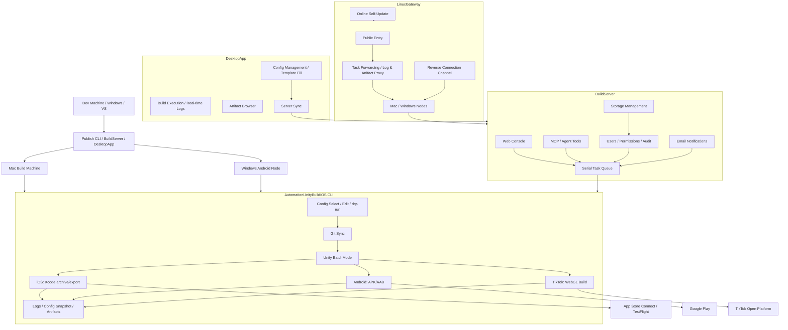

# AutomationUnityBuildIOS — Unity Multi-Platform Automated Build & Release System

> A production-proven toolchain for automated Unity mobile build and release. From Git sync, Unity BatchMode, Xcode/Android builds to App Store Connect / TestFlight, Google Play, and TikTok Mini-Game uploads — extended with a web build platform, desktop client, multi-node gateway scheduling, and AI Agent integration. It turns the entire release pipeline into a single, traceable, and scalable end-to-end workflow.

[](https://dotnet.microsoft.com/)
[](https://unity.com/)
[](docs/build-server.en.md)
[](docs/usage.en.md#desktop-client)
[](docs/linux-gateway.en.md)
[](docs/usage.en.md#regression-testing)
[](LICENSE)

[中文](README.md) | [English](README.en.md) | [日本語](README.ja.md) | [한국어](README.ko.md) | [Français](README.fr.md) | [Русский](README.ru.md) | [Español](README.es.md) | [Full Usage Guide](docs/usage.en.md) | [Architecture](docs/architecture.en.md)

---

## Repositories

- **Gitee**: https://gitee.com/chenfengloveyuri/automation-unity-build-ios
- **GitHub**: https://github.com/chenfengyimei/-AutomationUnityBuild

---

## What Is It

AutomationUnityBuildIOS is an end-to-end automated build and release system built for Unity mobile projects.

It is not a simple script wrapper — it is an engineering platform covering the full pipeline from source repository to app store. At its minimum, it is a .NET 8 command-line tool that runs on a Mac: select a config, and it automatically pulls the Unity repository, executes Unity Editor build scripts, exports an iOS Xcode project or Android APK/AAB, and generates logs and artifacts. In team mode, it becomes a web build platform: project leads manage projects and configs in a web backend, builders submit tasks with a click, and everyone views the queue, logs, artifacts, and audit records through a browser. In desktop mode, it provides a native Windows desktop client with full offline capability and one-click template population. In multi-device mode, it uses LinuxGateway to unify multiple Mac/Windows build machines under a single public entry point, supporting both direct-connect and reverse-tunnel networking.

It also covers TikTok Mini-Game WebGL builds with Open Platform API uploads, email notifications (success/failure, SMTP 465 implicit SSL), storage management (artifact cleanup / storage overview / bulk delete), four types of configuration templates (project / Unity / signing / certificate), and AI Agent participation in the build process via MCP tools.

It solves a very specific but painful problem: Unity mobile releases should never require memorizing commands, digging through paths, hunting for certificates, or manually reading logs every single time.

---

## Who Is It For

- **Unity mobile game/app teams**: Need to reliably produce iOS `.ipa`, `.xcarchive`, Android `.apk` / `.aab`, and auto-upload to App Store Connect / TestFlight / Google Play.
- **TikTok Mini-Game teams**: Need to build WebGL and upload directly to the TikTok Open Platform.
- **Indie developers**: Want to固化 the Mac build process into a reusable config, reducing manual work before every release.
- **QA / ops / publishing teams**: Want to trigger builds, download artifacts, and track history through a web UI or desktop client instead of remotely logging into build machines.
- **Multi-platform build teams**: Mac handles iOS and Android, Windows nodes handle Android, all unified under LinuxGateway.
- **AI / Agent workflow users**: Want to let Agents query projects, submit dry-runs, check status, and read logs and artifacts via MCP tools.

---

## Core Capabilities

| Capability | Description | Docs |
|------|------|------|
| **Local CLI Automated Build** | Numeric shortcut commands, interactive config wizard, config selector, config editor, dry-run and environment checks | [Usage Guide](docs/usage.en.md#local-cli-quick-start) |
| **iOS Full Pipeline** | Git sync, Unity Xcode project export, `xcodebuild archive/export`, copy `.xcarchive` to Organizer | [iOS Build](docs/usage.en.md#ios-build) |
| **App Store Connect Upload** | Auto-upload to App Store Connect/TestFlight via API Key, suited for unattended pipelines | [Store Upload](docs/usage.en.md#app-store-connect--testflight-upload) |
| **Android APK/AAB** | Supports `apk`, `aab`, `both` build formats, compatible with Android keystore and version management | [Android Build](docs/usage.en.md#android-build) |
| **Google Play Publishing** | Uses Service Account to call Google Play Publishing API, supports track, release status, and staged rollout | [Google Play](docs/usage.en.md#google-play-upload) |
| **TikTok Mini-Game** | WebGL build with auto-upload via TikTok Open Platform API, independent `Modules/Tiktok/` module | [TikTok Build](docs/usage.en.md#tiktok-mini-game-build) |
| **BuildServer Web Platform** | Login, project/config management, task queue, real-time logs, artifact download, user permissions, audit logs, email notifications, storage management | [BuildServer](docs/build-server.en.md) |
| **DesktopApp Desktop Client** | Native Windows desktop app built on Avalonia UI 11, full-featured offline config management, build execution, artifact browsing, template management, server sync | [Desktop Client](docs/usage.en.md#desktop-client) |
| **MCP / Agent Entry** | Provides `list_projects`, `start_build`, `get_build_status`, `tail_build_log` and other tools | [MCP/Agent](docs/build-server.en.md#mcpagent) |
| **LinuxGateway Multi-Node Entry** | Unifies multiple Mac/Windows BuildServer nodes under a single public entry on Linux, supporting direct-connect and reverse-tunnel | [LinuxGateway](docs/linux-gateway.en.md) |
| **Email Notifications** | Auto-send success/failure email notifications, supports SMTP 465 implicit SSL, contact lists, personalized templates | [Email Notifications](docs/usage.en.md#email-notifications) |
| **Storage Management** | Manual artifact cleanup, storage overview, bulk delete, preventing disk bloat on build machines | [Storage Management](docs/usage.en.md#storage-management) |
| **Configuration Templates** | Four template types (project / Unity / signing / certificate), one-click field population, server bidirectional sync | [Template Management](docs/usage.en.md#template-management) |
| **Security Boundaries** | Git repository whitelist, path root restrictions, config snapshots, sensitive data redaction, login & audit | [Architecture](docs/architecture.en.md#security-foundations) |
| **Log & Artifact Traceability** | Each run creates an independent directory with full logs, Unity logs, Xcode/Android logs, and config snapshot | [Log Troubleshooting](docs/usage.en.md#logs-and-artifacts) |

---

## Quick Start

On your dev machine, run help and dry-run first to verify the command entry:

```powershell
dotnet build .\AutomationUnityBuildIOS.sln
dotnet run --project .\AutomationUnityBuildIOS.csproj -- 00
dotnet run --project .\AutomationUnityBuildIOS.csproj -- run --config .\build-ios.sample.json --dry-run --allow-non-mac --skip-git --skip-xcode
dotnet run --project .\AutomationUnityBuildIOS.csproj -- run --config .\build-android.sample.json --dry-run --allow-non-mac --skip-git
```

Actual iOS builds must run on macOS. The common approach is to publish a Mac executable from Windows/VS or any .NET environment first:

```powershell
.\scripts\publish-mac.ps1 -Runtime osx-arm64
```

Copy `publish/osx-arm64` to your Mac, then:

```bash
cd ~/Downloads/publish_m1
xattr -cr .
chmod +x ./AutomationUnityBuildIOS
codesign --force --deep --sign - ./AutomationUnityBuildIOS
./AutomationUnityBuildIOS 00
./AutomationUnityBuildIOS 01
./AutomationUnityBuildIOS 06
```

For full setup, config fields, iOS/Android/TikTok store uploads, web platform, desktop client, and multi-node deployment, see [docs/usage.en.md](docs/usage.en.md).

---

## Running Modes

| Mode | Use Case | Entry |
|------|----------|-------|
| **CLI Standalone** | Solo or small team, operating directly on the Mac build machine | `./AutomationUnityBuildIOS 06` |
| **BuildServer Web Mode** | Team manages projects, configs, queues, logs, and artifacts through a browser | `http://127.0.0.1:5088` |
| **DesktopApp Desktop Mode** | Native Windows desktop client for offline config management, build execution, templates, and server sync | `DesktopApp.exe` |
| **MCP/Agent Mode** | Let AI Agents submit dry-runs, query status, and read logs via controlled tools | `POST /mcp` |
| **LinuxGateway Multi-Node Mode** | Multiple Mac/Windows build machines unified under a single public entry, supporting direct-connect and reverse-tunnel | `http://127.0.0.1:5090` |

---

## Architecture



The first version of BuildServer uses a single-machine, single-worker, serial-queue design — by design: Unity, Xcode, Gradle, signing certificates, and cache directories typically do not tolerate concurrent contention on the same machine. Multi-machine scaling is handled by LinuxGateway, distributing concurrent scheduling across different nodes, with support for both direct-connect and NAT traversal networking.

---

## Project Structure

```text
AutomationUnityBuildIOS/
├── Cli/                         # Command entry, arg parsing, numeric shortcuts
├── ConsoleUi/                   # Interactive menu, config wizard, config editor
├── Configuration/               # Config models, templates, path resolution, config file selection
├── Workflow/                    # Build pipeline orchestration, run context, config snapshots
├── Services/                    # Git, environment checks, directory prep, safety boundary validation
├── Modules/
│   ├── Common/                  # Platform pipeline, Unity commands, log diagnostics
│   ├── Ios/                     # Unity iOS export, Xcode archive/export, ASC upload
│   ├── Android/                 # Android APK/AAB, Google Play Publishing API
│   └── Tiktok/                  # TikTok Mini-Game WebGL build & Open Platform upload
├── Infrastructure/              # Logging, process execution, path tools, path safety, sensitive data redaction
├── UnityBuildScripts/
│   ├── Ios/BuildIOS.cs          # Copy to Unity project Assets/Editor
│   └── Android/BuildAndroid.cs  # Copy to Unity project Assets/Editor
├── BuildServer/                 # Web build platform, queue worker, MCP, node API, email, storage
├── LinuxGateway/                # Multi-device gateway, reverse connection, online self-update
├── DesktopApp/                  # Avalonia UI 11 desktop client, templates, server sync
├── deploy/                      # launchd, Docker deployment templates
├── docs/                        # Usage, architecture, and deployment docs
├── scripts/                     # Publish scripts (CLI/BuildServer/LinuxGateway/DesktopApp)
└── AutomationUnityBuildIOS.Tests/
```

---

## Documentation

| Document | Content |
|------|------|
| [docs/usage.en.md](docs/usage.en.md) | Getting started with CLI, DesktopApp, BuildServer, LinuxGateway, and MCP |
| [docs/architecture.en.md](docs/architecture.en.md) | Directory responsibilities, core modules, platform security capabilities |
| [docs/build-server.en.md](docs/build-server.en.md) | BuildServer startup, data, MCP, Gateway API, and extension directions |
| [docs/linux-gateway.en.md](docs/linux-gateway.en.md) | LinuxGateway node registration, reverse connection, self-update, and deployment |
| [docs/linux-gateway-docker.md](docs/linux-gateway-docker.md) | LinuxGateway Docker deployment guide |

---

## Development & Verification

```powershell
.\scripts\verify.ps1
```

This script performs solution compilation, CLI help entry, iOS/Android dry-run, config editor open-exit, and BuildServer/LinuxGateway basic compilation verification.

The test suite covers 256+ test cases, spanning CLI argument parsing, config models, path safety, Git policies, Unity command building, Google Play API, TikTok configs, BuildServer API routes, LinuxGateway node communication, reverse connection, email notifications, and all other modules.

---

## Status

| Module | Status |
|------|------|
| CLI iOS Automated Build | ✅ Production |
| CLI Android APK/AAB Build | ✅ Production |
| CLI TikTok Mini-Game Build | ✅ Usable |
| App Store Connect / TestFlight Upload | ✅ Production |
| Google Play Upload | ✅ Production |
| BuildServer Web Platform | ✅ Usable |
| DesktopApp Desktop Client | ✅ Usable |
| MCP/Agent Tool Entry | ✅ Usable |
| LinuxGateway Multi-Node Entry | ✅ Usable |
| LinuxGateway Reverse Connection | ✅ Usable |
| LinuxGateway Online Self-Update | ✅ Usable |
| Email Notifications | ✅ Usable |
| Storage Management | ✅ Usable |
| Configuration Template Management | ✅ Usable |
| Multi-Worker Database-Scheduled Dispatch | Future evolution |

---

## License

This project is licensed under the [Apache License 2.0](LICENSE).
