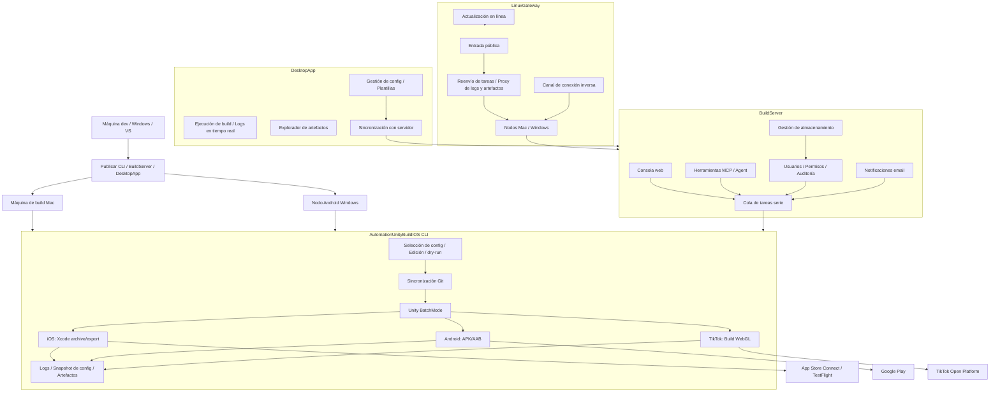

# AutomationUnityBuildIOS — Sistema de build y release automatizado multiplataforma para Unity

> Una cadena de herramientas de build y release Unity móvil probada en producción. Desde la sincronización Git, Unity BatchMode, builds de Xcode/Android hasta la subida a App Store Connect / TestFlight, Google Play y TikTok Mini-Game — extendida con una plataforma web de build, un cliente de escritorio, una pasarela multi-nodo y integración de AI Agent. Convierte todo el pipeline de release en un flujo de trabajo de extremo a extremo trazable y escalable.

[](https://dotnet.microsoft.com/)
[](https://unity.com/)
[](docs/build-server.es.md)
[](docs/usage.es.md#cliente-de-escritorio)
[](docs/linux-gateway.es.md)
[](docs/usage.es.md#pruebas-de-regresión)
[](LICENSE)

[中文](README.md) | [English](README.en.md) | [日本語](README.ja.md) | [한국어](README.ko.md) | [Français](README.fr.md) | [Русский](README.ru.md) | [Español](README.es.md) | [Guía completa](docs/usage.es.md) | [Arquitectura](docs/architecture.es.md)

---

## Repositorios

- **Gitee**: https://gitee.com/chenfengloveyuri/automation-unity-build-ios
- **GitHub**: https://github.com/chenfengyimei/-AutomationUnityBuild

---

## Descripción

AutomationUnityBuildIOS es un sistema de build y release automatizado de extremo a extremo, diseñado para proyectos Unity móviles.

No es un simple wrapper de scripts — es una plataforma de ingeniería que cubre todo el pipeline, desde el repositorio de código fuente hasta la tienda de aplicaciones. En su forma mínima, es una herramienta de línea de comandos .NET 8 que se ejecuta en un Mac: selecciona una configuración y automáticamente hace pull del repositorio de Unity, ejecuta los scripts de build de Unity Editor, exporta un proyecto Xcode de iOS o un APK/AAB de Android, y genera logs y artefactos. En modo equipo, se convierte en una plataforma web de build: los líderes gestionan proyectos y configuraciones en un backend web, los builders envían tareas con un clic, y todos consultan la cola, los logs, los artefactos y los registros de auditoría a través de un navegador. En modo de escritorio, proporciona un cliente de escritorio Windows nativo con capacidades offline completas y aplicación de plantillas con un clic. En modo multi-dispositivo, utiliza LinuxGateway para unificar múltiples máquinas de build Mac/Windows bajo un único punto de entrada público, con soporte de conexión directa y túnel inverso.

También cubre builds WebGL de TikTok Mini-Game con subida vía la API de Open Platform, notificaciones por email (éxito/fallo, SMTP 465 SSL implícito), gestión de almacenamiento (limpieza de artefactos / vista general / eliminación masiva), cuatro tipos de plantillas de configuración (proyecto / Unity / firma / certificado) y la participación de AI Agents en el proceso de build mediante herramientas MCP.

Resuelve un problema muy específico pero doloroso: los releases Unity móviles nunca deberían requerir memorizar comandos, buscar rutas, cazar certificados o leer logs manualmente cada vez.

---

## Público objetivo

- **Equipos de juegos/aplicaciones Unity móviles**: necesitan generar de forma fiable `.ipa` de iOS, `.xcarchive`, `.apk` / `.aab` de Android, y subir automáticamente a App Store Connect / TestFlight / Google Play.
- **Equipos de TikTok Mini-Game**: necesitan build WebGL y subida directa a la plataforma TikTok Open Platform.
- **Desarrolladores independientes**: desean fijar el proceso de build de Mac en una configuración reutilizable, reduciendo el trabajo manual antes de cada release.
- **Equipos de QA / ops / publishing**: desean lanzar builds, descargar artefactos y rastrear el historial a través de una interfaz web o un cliente de escritorio en lugar de iniciar sesión remotamente en las máquinas de build.
- **Equipos de build multiplataforma**: Mac maneja iOS y Android, los nodos Windows manejan Android, todo unificado bajo LinuxGateway.
- **Usuarios de workflows de AI / Agent**: desean que los Agents consulten proyectos, envíen dry-runs, verifiquen estados y lean logs y artefactos mediante herramientas MCP.

---

## Capacidades clave

| Capacidad | Descripción | Docs |
|------|------|------|
| **Build automatizado CLI local** | Comandos numéricos abreviados, asistente de configuración interactivo, selector de configuración, editor de configuración, dry-run y verificación de entorno | [Guía](docs/usage.es.md#inicio-rápido-cli-local) |
| **Pipeline iOS completo** | Sincronización Git, exportación de proyecto Xcode de Unity, `xcodebuild archive/export`, copia de `.xcarchive` a Organizer | [Build iOS](docs/usage.es.md#build-ios) |
| **Subida a App Store Connect** | Subida automática a App Store Connect/TestFlight vía API Key, adecuada para pipelines no atendidos | [Subida a store](docs/usage.es.md#subida-a-app-store-connect--testflight) |
| **Android APK/AAB** | Soporta formatos `apk`, `aab`, `both`, compatible con keystore de Android y gestión de versiones | [Build Android](docs/usage.es.md#build-android) |
| **Publicación en Google Play** | Usa Service Account para llamar a la API de Google Play Publishing, soporta track, release status y despliegue progresivo | [Google Play](docs/usage.es.md#subida-a-google-play) |
| **TikTok Mini-Game** | Build WebGL con subida automática vía API de TikTok Open Platform, módulo independiente `Modules/Tiktok/` | [Build TikTok](docs/usage.es.md#build-tiktok-mini-game) |
| **Plataforma web BuildServer** | Login, gestión de proyectos/configuraciones, cola de tareas, logs en tiempo real, descarga de artefactos, permisos de usuario, logs de auditoría, notificaciones por email, gestión de almacenamiento | [BuildServer](docs/build-server.es.md) |
| **Cliente de escritorio DesktopApp** | Aplicación de escritorio Windows nativa en Avalonia UI 11, gestión de configuración offline completa, ejecución de builds, exploración de artefactos, gestión de plantillas, sincronización con servidor | [Cliente de escritorio](docs/usage.es.md#cliente-de-escritorio) |
| **Entrada MCP / Agent** | Proporciona `list_projects`, `start_build`, `get_build_status`, `tail_build_log` y otras herramientas | [MCP/Agent](docs/build-server.es.md#mcpagent) |
| **Entrada multi-nodo LinuxGateway** | Unifica múltiples nodos BuildServer Mac/Windows bajo un único punto de entrada público en Linux, soporta conexión directa y túnel inverso | [LinuxGateway](docs/linux-gateway.es.md) |
| **Notificaciones por email** | Envío automático de emails de éxito/fallo, soporta SMTP 465 SSL implícito, listas de contactos, plantillas personalizadas | [Notificaciones email](docs/usage.es.md#notificaciones-por-email) |
| **Gestión de almacenamiento** | Limpieza manual de artefactos, vista general de almacenamiento, eliminación masiva, prevención de saturación de disco | [Gestión de almacenamiento](docs/usage.es.md#gestión-de-almacenamiento) |
| **Plantillas de configuración** | Cuatro tipos de plantillas (proyecto / Unity / firma / certificado), relleno de campos con un clic, sincronización bidireccional con servidor | [Gestión de plantillas](docs/usage.es.md#gestión-de-plantillas) |
| **Perímetros de seguridad** | Lista blanca de repositorios Git, restricción de rutas raíz, snapshots de configuración, enmascaramiento de datos sensibles, login y auditoría | [Arquitectura](docs/architecture.es.md#fundamentos-de-seguridad) |
| **Trazabilidad de logs y artefactos** | Cada ejecución crea un directorio independiente con logs completos, logs de Unity, logs de Xcode/Android y snapshot de configuración | [Resolución de problemas](docs/usage.es.md#logs-y-artefactos) |

---

## Inicio rápido

En su máquina de desarrollo, ejecute primero la ayuda y el dry-run para verificar el punto de entrada:

```powershell
dotnet build .\AutomationUnityBuildIOS.sln
dotnet run --project .\AutomationUnityBuildIOS.csproj -- 00
dotnet run --project .\AutomationUnityBuildIOS.csproj -- run --config .\build-ios.sample.json --dry-run --allow-non-mac --skip-git --skip-xcode
dotnet run --project .\AutomationUnityBuildIOS.csproj -- run --config .\build-android.sample.json --dry-run --allow-non-mac --skip-git
```

Los builds reales de iOS deben ejecutarse en macOS. El enfoque habitual es publicar primero un ejecutable Mac desde Windows/VS o cualquier entorno .NET:

```powershell
.\scripts\publish-mac.ps1 -Runtime osx-arm64
```

Copie `publish/osx-arm64` a su Mac, luego:

```bash
cd ~/Downloads/publish_m1
xattr -cr .
chmod +x ./AutomationUnityBuildIOS
codesign --force --deep --sign - ./AutomationUnityBuildIOS
./AutomationUnityBuildIOS 00
./AutomationUnityBuildIOS 01
./AutomationUnityBuildIOS 06
```

Para la configuración completa, campos de configuración, subidas iOS/Android/TikTok, plataforma web, cliente de escritorio y despliegue multi-nodo, ver [docs/usage.es.md](docs/usage.es.md).

---

## Modos de ejecución

| Modo | Caso de uso | Punto de entrada |
|------|----------|-------|
| **CLI autónomo** | Individual o equipo pequeño, operación directa en la máquina de build Mac | `./AutomationUnityBuildIOS 06` |
| **BuildServer modo web** | El equipo gestiona proyectos, configuraciones, colas, logs y artefactos vía navegador | `http://127.0.0.1:5088` |
| **DesktopApp modo escritorio** | Cliente de escritorio Windows nativo, gestión de configuración offline, ejecución de builds, plantillas, sincronización con servidor | `DesktopApp.exe` |
| **Modo MCP/Agent** | AI Agents envían dry-runs, consultan estados y leen logs mediante herramientas controladas | `POST /mcp` |
| **LinuxGateway multi-nodo** | Múltiples máquinas de build Mac/Windows unificadas bajo un único punto de entrada público, soporta conexión directa y túnel inverso | `http://127.0.0.1:5090` |

---

## Arquitectura



La primera versión de BuildServer utiliza un diseño de máquina única, worker único y cola serie — por diseño: Unity, Xcode, Gradle, los certificados de firma y los directorios de caché generalmente no toleran la contención concurrente en la misma máquina. La escalabilidad multi-máquina es gestionada por LinuxGateway, distribuyendo la planificación concurrente entre diferentes nodos, con soporte de conexión directa y traversal NAT.

---

## Estructura del proyecto

```text
AutomationUnityBuildIOS/
├── Cli/                         # Punto de entrada de comandos, parsing de argumentos, atajos numéricos
├── ConsoleUi/                   # Menú interactivo, asistente de configuración, editor de configuración
├── Configuration/               # Modelos de configuración, plantillas, resolución de rutas, selección de archivos de config
├── Workflow/                    # Orquestación del pipeline de build, contexto de ejecución, snapshots de configuración
├── Services/                    # Git, verificaciones de entorno, preparación de directorios, validación de seguridad
├── Modules/
│   ├── Common/                  # Pipeline de plataforma, comandos Unity, diagnóstico de logs
│   ├── Ios/                     # Exportación Unity iOS, Xcode archive/export, subida ASC
│   ├── Android/                 # Android APK/AAB, API de Google Play Publishing
│   └── Tiktok/                  # Build WebGL TikTok Mini-Game y subida a Open Platform
├── Infrastructure/              # Logging, ejecución de procesos, herramientas de ruta, seguridad de rutas, enmascaramiento de datos
├── UnityBuildScripts/
│   ├── Ios/BuildIOS.cs          # Copiar a Assets/Editor del proyecto Unity
│   └── Android/BuildAndroid.cs  # Copiar a Assets/Editor del proyecto Unity
├── BuildServer/                 # Plataforma web de build, worker de cola, MCP, API de nodo, email, almacenamiento
├── LinuxGateway/                # Pasarela multi-dispositivo, conexión inversa, actualización en línea
├── DesktopApp/                  # Cliente de escritorio Avalonia UI 11, plantillas, sincronización con servidor
├── deploy/                      # Plantillas de despliegue launchd, Docker
├── docs/                        # Documentación de uso, arquitectura y despliegue
├── scripts/                     # Scripts de publicación (CLI/BuildServer/LinuxGateway/DesktopApp)
└── AutomationUnityBuildIOS.Tests/
```

---

## Navegación de documentación

| Documento | Contenido |
|------|------|
| [docs/usage.es.md](docs/usage.es.md) | Guía de inicio con CLI, DesktopApp, BuildServer, LinuxGateway y MCP |
| [docs/architecture.es.md](docs/architecture.es.md) | Responsabilidades de directorios, módulos clave, capacidades de seguridad de plataforma |
| [docs/build-server.es.md](docs/build-server.es.md) | Inicio de BuildServer, datos, MCP, API Gateway y direcciones de extensión |
| [docs/linux-gateway.es.md](docs/linux-gateway.es.md) | Registro de nodos LinuxGateway, conexión inversa, actualización, despliegue |
| [docs/linux-gateway-docker.md](docs/linux-gateway-docker.md) | Guía de despliegue Docker para LinuxGateway |

---

## Desarrollo y verificación

```powershell
.\scripts\verify.ps1
```

Este script realiza la compilación de la solución, la entrada de ayuda CLI, el dry-run iOS/Android, la apertura-cierre del editor de configuración y la verificación de compilación básica de BuildServer/LinuxGateway.

El conjunto de pruebas cubre 256+ casos de test, abarcando el parsing de argumentos CLI, los modelos de configuración, la seguridad de rutas, las políticas Git, la construcción de comandos Unity, la API de Google Play, las configuraciones TikTok, las rutas de la API BuildServer, la comunicación de nodos LinuxGateway, la conexión inversa, las notificaciones por email y todos los demás módulos.

---

## Estado actual

| Módulo | Estado |
|------|------|
| Build automatizado iOS CLI | ✅ Producción |
| Build Android APK/AAB CLI | ✅ Producción |
| Build TikTok Mini-Game CLI | ✅ Utilizable |
| Subida a App Store Connect / TestFlight | ✅ Producción |
| Subida a Google Play | ✅ Producción |
| Plataforma web BuildServer | ✅ Utilizable |
| Cliente de escritorio DesktopApp | ✅ Utilizable |
| Entrada de herramientas MCP/Agent | ✅ Utilizable |
| Entrada multi-nodo LinuxGateway | ✅ Utilizable |
| Conexión inversa LinuxGateway | ✅ Utilizable |
| Actualización en línea LinuxGateway | ✅ Utilizable |
| Notificaciones por email | ✅ Utilizable |
| Gestión de almacenamiento | ✅ Utilizable |
| Gestión de plantillas de configuración | ✅ Utilizable |
| Planificación multi-worker con base de datos | Evolución futura |

---

## Licencia

Este proyecto está licenciado bajo [Apache License 2.0](LICENSE).
