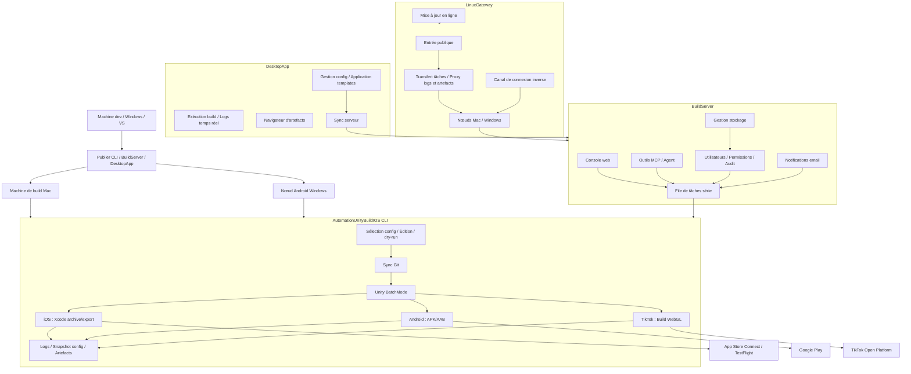

# AutomationUnityBuildIOS — Système de build et de release automatisé multiplateforme pour Unity

> Une chaîne d'outils de build et de release Unity mobile éprouvée en production. De la synchronisation Git, Unity BatchMode, builds Xcode/Android jusqu'à App Store Connect / TestFlight, Google Play et l'upload TikTok Mini-Game — étendue avec une plateforme web de build, un client desktop, une passerelle multi-nœuds et une intégration AI Agent. Elle transforme l'ensemble du pipeline de release en un flux de bout en bout traçable et extensible.

[](https://dotnet.microsoft.com/)
[](https://unity.com/)
[](docs/build-server.fr.md)
[](docs/usage.fr.md#client-desktop)
[](docs/linux-gateway.fr.md)
[](docs/usage.fr.md#tests-de-régression)
[](LICENSE)

[中文](README.md) | [English](README.en.md) | [日本語](README.ja.md) | [한국어](README.ko.md) | [Français](README.fr.md) | [Русский](README.ru.md) | [Español](README.es.md) | [Guide complet](docs/usage.fr.md) | [Architecture](docs/architecture.fr.md)

---

## Dépôts

- **Gitee** : https://gitee.com/chenfengloveyuri/automation-unity-build-ios
- **GitHub** : https://github.com/chenfengyimei/-AutomationUnityBuild

---

## Présentation

AutomationUnityBuildIOS est un système de build et de release automatisé de bout en bout, conçu pour les projets Unity mobiles.

Ce n'est pas un simple wrapper de scripts — c'est une plateforme d'ingénierie couvrant l'ensemble du pipeline, du dépôt de code au store d'applications. Dans sa forme minimale, c'est un outil en ligne de commande .NET 8 qui s'exécute sur un Mac : sélectionnez une config, et il pull automatiquement le dépôt Unity, exécute les scripts de build Unity Editor, exporte un projet Xcode iOS ou un APK/AAB Android, et génère logs et artefacts. En mode équipe, il devient une plateforme web de build : les responsables gèrent les projets et configs dans un backend web, les builders soumettent des tâches d'un clic, et tout le monde consulte la file d'attente, les logs, les artefacts et les audits via un navigateur. En mode desktop, il fournit un client desktop Windows natif avec capacités hors-ligne complètes et application de templates en un clic. En mode multi-appareils, il utilise LinuxGateway pour unifier plusieurs machines de build Mac/Windows sous une seule entrée publique, avec support des connexions directes et des tunnels inversés.

Il couvre également les builds WebGL TikTok Mini-Game avec upload via l'API Open Platform, les notifications email (succès/échec, SMTP 465 SSL implicite), la gestion du stockage (nettoyage d'artefacts / vue d'ensemble / suppression en lot), quatre types de templates de configuration (projet / Unity / signature / certificat), et la participation d'AI Agents au processus de build via les outils MCP.

Il résout un problème très spécifique mais douloureux : les releases Unity mobile ne devraient jamais nécessiter de mémoriser des commandes, fouiller des chemins, chercher des certificats ou lire des logs manuellement à chaque fois.

---

## Public cible

- **Équipes de jeux/applications Unity mobile** : besoin de produire fiablement des `.ipa` iOS, `.xcarchive`, `.apk` / `.aab` Android, et d'uploader automatiquement vers App Store Connect / TestFlight / Google Play.
- **Équipes TikTok Mini-Game** : besoin de build WebGL et d'upload direct vers la plateforme ouverte TikTok.
- **Développeurs indépendants** : vouloir figer le processus de build Mac dans une config réutilisable, réduisant le travail manuel avant chaque release.
- **Équipes QA / ops / publishing** : vouloir déclencher des builds, télécharger des artefacts et suivre l'historique via une interface web ou un client desktop plutôt qu'en se connectant à distance aux machines de build.
- **Équipes de build multiplateforme** : Mac gère iOS et Android, les nœuds Windows gèrent Android, le tout unifié sous LinuxGateway.
- **Utilisateurs de workflows AI / Agent** : vouloir laisser les Agents interroger les projets, soumettre des dry-runs, vérifier les statuts et lire les logs et artefacts via les outils MCP.

---

## Fonctionnalités clés

| Fonctionnalité | Description | Docs |
|------|------|------|
| **Build automatisé CLI local** | Commandes raccourcies numériques, assistant de config interactif, sélecteur de config, éditeur de config, dry-run et vérification d'environnement | [Guide d'utilisation](docs/usage.fr.md#démarrage-rapide-cli-local) |
| **Pipeline iOS complet** | Sync Git, export du projet Xcode Unity, `xcodebuild archive/export`, copie `.xcarchive` vers Organizer | [Build iOS](docs/usage.fr.md#build-ios) |
| **Upload App Store Connect** | Upload automatique vers App Store Connect/TestFlight via API Key, adapté aux pipelines sans surveillance | [Upload store](docs/usage.fr.md#upload-app-store-connect--testflight) |
| **Android APK/AAB** | Supporte les formats `apk`, `aab`, `both`, compatible avec keystore Android et gestion de version | [Build Android](docs/usage.fr.md#build-android) |
| **Publication Google Play** | Utilise un Service Account pour appeler l'API Google Play Publishing, supporte track, release status et rollout progressif | [Google Play](docs/usage.fr.md#upload-google-play) |
| **TikTok Mini-Game** | Build WebGL avec upload automatique via l'API TikTok Open Platform, module `Modules/Tiktok/` indépendant | [Build TikTok](docs/usage.fr.md#build-tiktok-mini-game) |
| **Plateforme web BuildServer** | Login, gestion projets/configs, file de tâches, logs temps réel, téléchargement d'artefacts, permissions, audit, notifications email, gestion du stockage | [BuildServer](docs/build-server.fr.md) |
| **Client desktop DesktopApp** | Application desktop Windows native sur Avalonia UI 11, gestion de config hors-ligne complète, exécution de builds, navigation d'artefacts, gestion de templates, sync serveur | [Client desktop](docs/usage.fr.md#client-desktop) |
| **Entrée MCP / Agent** | Fournit `list_projects`, `start_build`, `get_build_status`, `tail_build_log` et autres outils | [MCP/Agent](docs/build-server.fr.md#mcpagent) |
| **Entrée multi-nœuds LinuxGateway** | Unifie plusieurs nœuds BuildServer Mac/Windows sous une entrée publique Linux, supporte connexion directe et tunnel inverse | [LinuxGateway](docs/linux-gateway.fr.md) |
| **Notifications email** | Envoi automatique d'emails succès/échec, supporte SMTP 465 SSL implicite, listes de contacts, templates personnalisés | [Notifications email](docs/usage.fr.md#notifications-email) |
| **Gestion du stockage** | Nettoyage manuel d'artefacts, vue d'ensemble du stockage, suppression en lot, prévention de l'encombrement disque | [Gestion stockage](docs/usage.fr.md#gestion-du-stockage) |
| **Templates de configuration** | Quatre types de templates (projet / Unity / signature / certificat), remplissage en un clic, sync bidirectionnelle serveur | [Gestion templates](docs/usage.fr.md#gestion-des-templates) |
| **Périmètres de sécurité** | Liste blanche de dépôts Git, restriction des chemins racines, snapshots de config, masquage des informations sensibles, login et audit | [Architecture](docs/architecture.fr.md#fondations-de-sécurité) |
| **Traçabilité logs et artefacts** | Chaque exécution crée un répertoire indépendant avec logs complets, logs Unity, logs Xcode/Android et snapshot de config | [Dépannage logs](docs/usage.fr.md#logs-et-artefacts) |

---

## Démarrage rapide

Sur votre machine de dev, exécutez d'abord l'aide et le dry-run pour vérifier le point d'entrée :

```powershell
dotnet build .\AutomationUnityBuildIOS.sln
dotnet run --project .\AutomationUnityBuildIOS.csproj -- 00
dotnet run --project .\AutomationUnityBuildIOS.csproj -- run --config .\build-ios.sample.json --dry-run --allow-non-mac --skip-git --skip-xcode
dotnet run --project .\AutomationUnityBuildIOS.csproj -- run --config .\build-android.sample.json --dry-run --allow-non-mac --skip-git
```

Les builds iOS réels doivent s'exécuter sur macOS. L'approche courante consiste à publier un exécutable Mac depuis Windows/VS ou tout environnement .NET :

```powershell
.\scripts\publish-mac.ps1 -Runtime osx-arm64
```

Copiez `publish/osx-arm64` sur votre Mac, puis :

```bash
cd ~/Downloads/publish_m1
xattr -cr .
chmod +x ./AutomationUnityBuildIOS
codesign --force --deep --sign - ./AutomationUnityBuildIOS
./AutomationUnityBuildIOS 00
./AutomationUnityBuildIOS 01
./AutomationUnityBuildIOS 06
```

Pour la configuration complète, les champs de config, les uploads iOS/Android/TikTok, la plateforme web, le client desktop et le déploiement multi-nœuds, voir [docs/usage.fr.md](docs/usage.fr.md).

---

## Modes d'exécution

| Mode | Cas d'usage | Entrée |
|------|----------|-------|
| **CLI autonome** | Solo ou petite équipe, opération directe sur la machine de build Mac | `./AutomationUnityBuildIOS 06` |
| **BuildServer mode web** | L'équipe gère projets, configs, files, logs et artefacts via navigateur | `http://127.0.0.1:5088` |
| **DesktopApp mode desktop** | Client desktop Windows natif, gestion de config hors-ligne, exécution de builds, templates, sync serveur | `DesktopApp.exe` |
| **Mode MCP/Agent** | Les AI Agents soumettent des dry-runs, interrogent les statuts et lisent les logs via des outils contrôlés | `POST /mcp` |
| **LinuxGateway multi-nœuds** | Plusieurs machines de build Mac/Windows unifiées sous une entrée publique, supporte connexion directe et tunnel inverse | `http://127.0.0.1:5090` |

---

## Architecture



La première version de BuildServer utilise un design mono-machine, mono-worker, file série — par choix : Unity, Xcode, Gradle, les certificats de signature et les répertoires de cache ne tolèrent généralement pas la contention concurrente sur la même machine. L'extension multi-machines est gérée par LinuxGateway, distribuant la planification concurrente sur différents nœuds, avec support des connexions directes et de la traversée NAT.

---

## Structure du projet

```text
AutomationUnityBuildIOS/
├── Cli/                         # Entrée de commande, parsing d'args, raccourcis numériques
├── ConsoleUi/                   # Menu interactif, assistant config, éditeur de config
├── Configuration/               # Modèles de config, templates, résolution de chemins, sélection de config
├── Workflow/                    # Orchestration du pipeline de build, contexte d'exécution, snapshots de config
├── Services/                    # Git, vérifications d'environnement, préparation de répertoires, validation de sécurité
├── Modules/
│   ├── Common/                  # Pipeline de plateforme, commandes Unity, diagnostic des logs
│   ├── Ios/                     # Export Unity iOS, Xcode archive/export, upload ASC
│   ├── Android/                 # Android APK/AAB, API Google Play Publishing
│   └── Tiktok/                  # Build WebGL TikTok Mini-Game & upload Open Platform
├── Infrastructure/              # Logging, exécution de processus, outils de chemin, sécurité des chemins, masquage des données sensibles
├── UnityBuildScripts/
│   ├── Ios/BuildIOS.cs          # Copier dans Assets/Editor du projet Unity
│   └── Android/BuildAndroid.cs  # Copier dans Assets/Editor du projet Unity
├── BuildServer/                 # Plateforme web de build, worker de file, MCP, API nœud, email, stockage
├── LinuxGateway/                # Passerelle multi-appareils, connexion inverse, mise à jour en ligne
├── DesktopApp/                  # Client desktop Avalonia UI 11, templates, sync serveur
├── deploy/                      # Templates de déploiement launchd, Docker
├── docs/                        # Documentation d'utilisation, d'architecture et de déploiement
├── scripts/                     # Scripts de publication (CLI/BuildServer/LinuxGateway/DesktopApp)
└── AutomationUnityBuildIOS.Tests/
```

---

## Documentation

| Document | Contenu |
|------|------|
| [docs/usage.fr.md](docs/usage.fr.md) | Guide de démarrage avec CLI, DesktopApp, BuildServer, LinuxGateway et MCP |
| [docs/architecture.fr.md](docs/architecture.fr.md) | Responsabilités des répertoires, modules clés, capacités de sécurité plateforme |
| [docs/build-server.fr.md](docs/build-server.fr.md) | Démarrage de BuildServer, données, MCP, API Gateway et directions d'extension |
| [docs/linux-gateway.fr.md](docs/linux-gateway.fr.md) | Enregistrement de nœuds LinuxGateway, connexion inverse, mise à jour, déploiement |
| [docs/linux-gateway-docker.md](docs/linux-gateway-docker.md) | Guide de déploiement Docker pour LinuxGateway |

---

## Développement et vérification

```powershell
.\scripts\verify.ps1
```

Ce script effectue la compilation de la solution, l'entrée d'aide CLI, le dry-run iOS/Android, l'ouverture-fermeture de l'éditeur de config, et la vérification de compilation de base de BuildServer/LinuxGateway.

La suite de tests couvre 256+ cas de test, englobant le parsing d'arguments CLI, les modèles de config, la sécurité des chemins, les politiques Git, la construction de commandes Unity, l'API Google Play, les configs TikTok, les routes API BuildServer, la communication de nœuds LinuxGateway, la connexion inverse, les notifications email et tous les autres modules.

---

## Statut actuel

| Module | Statut |
|------|------|
| Build automatisé iOS CLI | ✅ Production |
| Build Android APK/AAB CLI | ✅ Production |
| Build TikTok Mini-Game CLI | ✅ Utilisable |
| Upload App Store Connect / TestFlight | ✅ Production |
| Upload Google Play | ✅ Production |
| Plateforme web BuildServer | ✅ Utilisable |
| Client desktop DesktopApp | ✅ Utilisable |
| Entrée outils MCP/Agent | ✅ Utilisable |
| Entrée multi-nœuds LinuxGateway | ✅ Utilisable |
| Connexion inverse LinuxGateway | ✅ Utilisable |
| Mise à jour en ligne LinuxGateway | ✅ Utilisable |
| Notifications email | ✅ Utilisable |
| Gestion du stockage | ✅ Utilisable |
| Gestion des templates de configuration | ✅ Utilisable |
| Planification multi-worker avec base de données | Évolution future |

---

## Licence

Ce projet est sous licence [Apache License 2.0](LICENSE).
