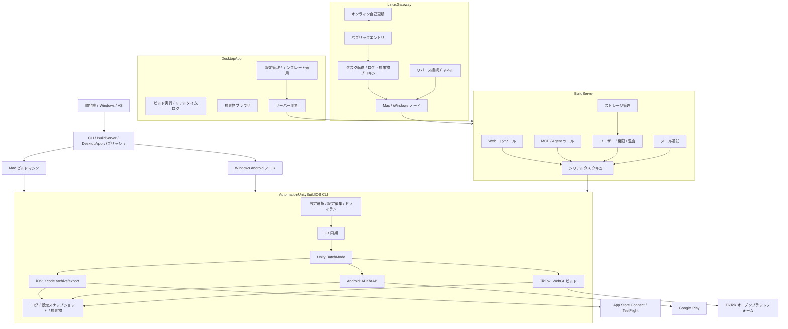

# AutomationUnityBuildIOS — Unity マルチプラットフォーム自動ビルド＆リリースシステム

> 本番環境で実証済みの Unity モバイルビルド・リリースツールチェーン。Git 同期、Unity BatchMode、Xcode / Android ビルドから App Store Connect / TestFlight、Google Play、TikTok ミニゲームアップロードまで、Web ビルドプラットフォーム、デスクトップクライアント、マルチノードゲートウェイスケジューリング、AI Agent 統合を備え、リリースパイプライン全体を一つのトレーサブルで拡張可能なエンドツーエンドワークフローに統合します。

[](https://dotnet.microsoft.com/)
[](https://unity.com/)
[](docs/build-server.ja.md)
[](docs/usage.ja.md#デスクトップクライアント)
[](docs/linux-gateway.ja.md)
[](docs/usage.ja.md#回帰テスト)
[](LICENSE)

[中文](README.md) | [English](README.en.md) | [日本語](README.ja.md) | [한국어](README.ko.md) | [Français](README.fr.md) | [完全利用ガイド](docs/usage.ja.md) | [アーキテクチャ](docs/architecture.ja.md)

---

## リポジトリ

- **Gitee**: https://gitee.com/chenfengloveyuri/automation-unity-build-ios
- **GitHub**: https://github.com/chenfengyimei/-AutomationUnityBuild

---

## 概要

AutomationUnityBuildIOS は、Unity モバイルプロジェクト向けに構築されたエンドツーエンドの自動ビルド・リリースシステムです。

単なるスクリプトラッパーではなく、ソースリポジトリからアプリストアまでの全パイプラインをカバーするエンジニアリングプラットフォームです。最小構成では、Mac にコピーして実行できる .NET 8 コマンドラインツールとして動作します。設定を選択するだけで、Unity リポジトリの自動プル、Unity Editor ビルドスクリプトの実行、iOS Xcode プロジェクトまたは Android APK/AAB のエクスポート、ログと成果物の生成を自動的に行います。チーム運用では Web ビルドプラットフォームとして機能し、プロジェクトリーダーが Web バックエンドでプロジェクトと設定を管理し、ビルダーがクリックでタスクを送信し、全員がブラウザでキュー、ログ、成果物、監査記録を確認できます。デスクトップモードでは、完全なオフライン機能とワンクリックテンプレート適用を備えたネイティブ Windows デスクトップクライアントを提供します。マルチデバイスモードでは、LinuxGateway を使用して複数の Mac/Windows ビルドマシンを一つのパブリックエントリポイントに統合し、直接接続とリバーストンネルの両方をサポートします。

また、TikTok ミニゲームの WebGL ビルドとオープンプラットフォーム API アップロード、メール通知（成功/失敗、SMTP 465 暗黙 SSL）、ストレージ管理（成果物クリーンアップ / ストレージ概要 / 一括削除）、4種類の設定テンプレート（プロジェクト / Unity / 署名 / 証明書）、および MCP ツール経由での AI Agent のビルドプロセス参加機能もカバーしています。

このシステムが解決するのは、非常に具体的だが痛みを伴う問題です。Unity モバイルのリリース作業において、毎回コマンドを暗記し、パスを探し、証明書を探し、ログを手動で確認する必要はもうありません。

---

## ターゲットユーザー

- **Unity モバイルゲーム/アプリチーム**: iOS `.ipa`、`.xcarchive`、Android `.apk` / `.aab` を安定して生成し、App Store Connect / TestFlight / Google Play に自動アップロードが必要。
- **TikTok ミニゲームチーム**: WebGL ビルド後、TikTok オープンプラットフォームに直接アップロードが必要。
- **インディー開発者**: Mac のビルド手順を再利用可能な設定として固定し、毎回のリリース前の手作業を削減したい。
- **QA / 運用 / パブリッシングチーム**: ビルドマシンにリモートログインするのではなく、Web UI またはデスクトップクライアントからビルドをトリガーし、成果物をダウンロードし、履歴を追跡したい。
- **マルチプラットフォームビルドチーム**: Mac は iOS と Android を担当し、Windows ノードは Android を担当し、LinuxGateway で統合スケジューリング。
- **AI / Agent ワークフローユーザー**: Agent にプロジェクトの照会、ドライランの送信、ステータス確認、ログと成果物の読み取りを MCP ツールで行わせたい。

---

## コア機能

| 機能 | 説明 | ドキュメント |
|------|------|------|
| **ローカル CLI 自動ビルド** | 数字ショートカットコマンド、インタラクティブ設定ウィザード、設定セレクタ、設定エディタ、ドライランと環境チェック | [利用ガイド](docs/usage.ja.md#ローカルcliクイックスタート) |
| **iOS フルパイプライン** | Git 同期、Unity Xcode プロジェクトエクスポート、`xcodebuild archive/export`、`.xcarchive` の Organizer へコピー | [iOS ビルド](docs/usage.ja.md#iosビルド) |
| **App Store Connect アップロード** | API Key で App Store Connect/TestFlight に自動アップロード、無人パイプライン向け | [ストアアップロード](docs/usage.ja.md#app-store-connect--testflightアップロード) |
| **Android APK/AAB** | `apk`、`aab`、`both` の3種ビルドフォーマット、Android keystore とバージョン管理に対応 | [Android ビルド](docs/usage.ja.md#androidビルド) |
| **Google Play 公開** | Service Account で Google Play Publishing API を呼び出し、track、release status、段階的ロールアウトをサポート | [Google Play](docs/usage.ja.md#google-playアップロード) |
| **TikTok ミニゲーム** | WebGL ビルド後、TikTok オープンプラットフォーム API で自動アップロード、独立した `Modules/Tiktok/` モジュール | [TikTok ビルド](docs/usage.ja.md#tiktokミニゲームビルド) |
| **BuildServer Web プラットフォーム** | ログイン、プロジェクト/設定管理、タスクキュー、リアルタイムログ、成果物ダウンロード、ユーザー権限、監査ログ、メール通知、ストレージ管理 | [BuildServer](docs/build-server.ja.md) |
| **DesktopApp デスクトップクライアント** | Avalonia UI 11 ベースのネイティブ Windows デスクトップアプリ、フル機能オフライン設定管理、ビルド実行、成果物ブラウザ、テンプレート管理、サーバー同期 | [デスクトップクライアント](docs/usage.ja.md#デスクトップクライアント) |
| **MCP / Agent エントリ** | `list_projects`、`start_build`、`get_build_status`、`tail_build_log` などのツールを提供 | [MCP/Agent](docs/build-server.ja.md#mcpagent) |
| **LinuxGateway マルチノードエントリ** | Linux パブリックサーバー上で複数の Mac/Windows BuildServer ノードを統合、直接接続とリバーストンネルをサポート | [LinuxGateway](docs/linux-gateway.ja.md) |
| **メール通知** | ビルド成功/失敗時に自動メール送信、SMTP 465 暗黙 SSL、連絡先リスト、カスタムテンプレートをサポート | [メール通知](docs/usage.ja.md#メール通知) |
| **ストレージ管理** | 成果物の手動クリーンアップ、ストレージ概要、一括削除、ビルドマシンのディスク肥大化を防止 | [ストレージ管理](docs/usage.ja.md#ストレージ管理) |
| **設定テンプレート** | 4種テンプレート（プロジェクト / Unity / 署名 / 証明書）、ワンクリックでフィールド入力、サーバー双方向同期をサポート | [テンプレート管理](docs/usage.ja.md#テンプレート管理) |
| **セキュリティ境界** | Git リポジトリホワイトリスト、パスルート制限、設定スナップショット、機密情報マスキング、ログインと監査 | [アーキテクチャ](docs/architecture.ja.md#セキュリティ基盤) |
| **ログと成果物の追跡** | 毎回の実行で独立ディレクトリを生成、全体ログ、Unity ログ、Xcode/Android ログ、設定スナップショットを保存 | [ログトラブルシューティング](docs/usage.ja.md#ログと成果物) |

---

## クイックスタート

開発機でヘルプとドライランを先に実行し、コマンドエントリを確認します：

```powershell
dotnet build .\AutomationUnityBuildIOS.sln
dotnet run --project .\AutomationUnityBuildIOS.csproj -- 00
dotnet run --project .\AutomationUnityBuildIOS.csproj -- run --config .\build-ios.sample.json --dry-run --allow-non-mac --skip-git --skip-xcode
dotnet run --project .\AutomationUnityBuildIOS.csproj -- run --config .\build-android.sample.json --dry-run --allow-non-mac --skip-git
```

実際の iOS ビルドは macOS で実行する必要があります。一般的な方法は、Windows/VS または任意の .NET 環境から Mac 向け実行ファイルをパブリッシュすることです：

```powershell
.\scripts\publish-mac.ps1 -Runtime osx-arm64
```

`publish/osx-arm64` を Mac にコピー後：

```bash
cd ~/Downloads/publish_m1
xattr -cr .
chmod +x ./AutomationUnityBuildIOS
codesign --force --deep --sign - ./AutomationUnityBuildIOS
./AutomationUnityBuildIOS 00
./AutomationUnityBuildIOS 01
./AutomationUnityBuildIOS 06
```

完全なセットアップ、設定フィールド、iOS/Android/TikTok ストアアップロード、Web プラットフォーム、デスクトップクライアント、マルチノードデプロイについては [docs/usage.ja.md](docs/usage.ja.md) を参照してください。

---

## 実行モード

| モード | ユースケース | エントリ |
|------|----------|-------|
| **CLI スタンドアロン** | 個人または小規模チーム、Mac ビルドマシン上で直接操作 | `./AutomationUnityBuildIOS 06` |
| **BuildServer Web モード** | チームがブラウザでプロジェクト、設定、キュー、ログ、成果物を管理 | `http://127.0.0.1:5088` |
| **DesktopApp デスクトップモード** | ネイティブ Windows デスクトップクライアント、オフライン設定管理、ビルド実行、テンプレート、サーバー同期 | `DesktopApp.exe` |
| **MCP/Agent モード** | AI Agent が制御されたツールでドライランを送信、ステータス確認、ログ読み取り | `POST /mcp` |
| **LinuxGateway マルチノードモード** | 複数の Mac/Windows ビルドマシンを一つのパブリックエントリに統合、直接接続とリバーストンネルをサポート | `http://127.0.0.1:5090` |

---

## アーキテクチャ



BuildServer の初版はシングルマシン、シングル Worker、シリアルキュー設計を採用しています。これは意図的な設計です。Unity、Xcode、Gradle、署名証明書、キャッシュディレクトリは通常、同じマシンで並行して競合することに適していません。マルチマシン拡張は LinuxGateway が担当し、並行スケジューリングを異なるノードに分散させます。直接接続と NAT トラバーサルの両方をサポートします。

---

## プロジェクト構成

```text
AutomationUnityBuildIOS/
├── Cli/                         # コマンドエントリ、引数解析、数字ショートカット
├── ConsoleUi/                   # インタラクティブメニュー、設定ウィザード、設定エディタ
├── Configuration/               # 設定モデル、テンプレート、パス解決、設定ファイル選択
├── Workflow/                    # ビルドパイプライン編成、実行コンテキスト、設定スナップショット
├── Services/                    # Git、環境チェック、ディレクトリ準備、安全境界検証
├── Modules/
│   ├── Common/                  # プラットフォームパイプライン、Unity コマンド、ログ診断
│   ├── Ios/                     # Unity iOS エクスポート、Xcode archive/export、ASC アップロード
│   ├── Android/                 # Android APK/AAB、Google Play Publishing API
│   └── Tiktok/                  # TikTok ミニゲーム WebGL ビルド & オープンプラットフォームアップロード
├── Infrastructure/              # ログ、プロセス実行、パスツール、パス安全、機密情報マスキング
├── UnityBuildScripts/
│   ├── Ios/BuildIOS.cs          # Unity プロジェクトの Assets/Editor にコピー
│   └── Android/BuildAndroid.cs  # Unity プロジェクトの Assets/Editor にコピー
├── BuildServer/                 # Web ビルドプラットフォーム、キューワーカー、MCP、ノード API、メール、ストレージ
├── LinuxGateway/                # マルチデバイスゲートウェイ、リバース接続、オンライン自己更新
├── DesktopApp/                  # Avalonia UI 11 デスクトップクライアント、テンプレート、サーバー同期
├── deploy/                      # launchd、Docker デプロイテンプレート
├── docs/                        # 利用、アーキテクチャ、デプロイドキュメント
├── scripts/                     # パブリッシュスクリプト（CLI/BuildServer/LinuxGateway/DesktopApp）
└── AutomationUnityBuildIOS.Tests/
```

---

## ドキュメントナビゲーション

| ドキュメント | 内容 |
|------|------|
| [docs/usage.ja.md](docs/usage.ja.md) | CLI、DesktopApp、BuildServer、LinuxGateway、MCP の利用ガイド |
| [docs/architecture.ja.md](docs/architecture.ja.md) | ディレクトリ責務、コアモジュール、プラットフォームセキュリティ機能 |
| [docs/build-server.ja.md](docs/build-server.ja.md) | BuildServer の起動、データ、MCP、Gateway API、拡張方向 |
| [docs/linux-gateway.ja.md](docs/linux-gateway.ja.md) | LinuxGateway のノード登録、リバース接続、自己更新、デプロイ |
| [docs/linux-gateway-docker.md](docs/linux-gateway-docker.md) | LinuxGateway Docker デプロイガイド |

---

## 開発と検証

```powershell
.\scripts\verify.ps1
```

このスクリプトはソリューションコンパイル、CLI ヘルプエントリ、iOS/Android ドライラン、設定エディタの開閉、BuildServer/LinuxGateway の基本コンパイル検証を実行します。

テストスイートは 256 以上のテストケースをカバーし、CLI 引数解析、設定モデル、パス安全、Git ポリシー、Unity コマンドビルド、Google Play API、TikTok 設定、BuildServer API ルート、LinuxGateway ノード通信、リバース接続、メール通知など、全モジュールを網羅しています。

---

## 現在のステータス

| モジュール | ステータス |
|------|------|
| CLI iOS 自動ビルド | ✅ 本番級 |
| CLI Android APK/AAB ビルド | ✅ 本番級 |
| CLI TikTok ミニゲームビルド | ✅ 利用可能 |
| App Store Connect / TestFlight アップロード | ✅ 本番級 |
| Google Play アップロード | ✅ 本番級 |
| BuildServer Web プラットフォーム | ✅ 利用可能 |
| DesktopApp デスクトップクライアント | ✅ 利用可能 |
| MCP/Agent ツールエントリ | ✅ 利用可能 |
| LinuxGateway マルチノードエントリ | ✅ 利用可能 |
| LinuxGateway リバース接続 | ✅ 利用可能 |
| LinuxGateway オンライン自己更新 | ✅ 利用可能 |
| メール通知 | ✅ 利用可能 |
| ストレージ管理 | ✅ 利用可能 |
| 設定テンプレート管理 | ✅ 利用可能 |
| マルチ Worker DB スケジューリング | 今後の進化 |

---

## ライセンス

本プロジェクトは [Apache License 2.0](LICENSE) の下で公開されています。
