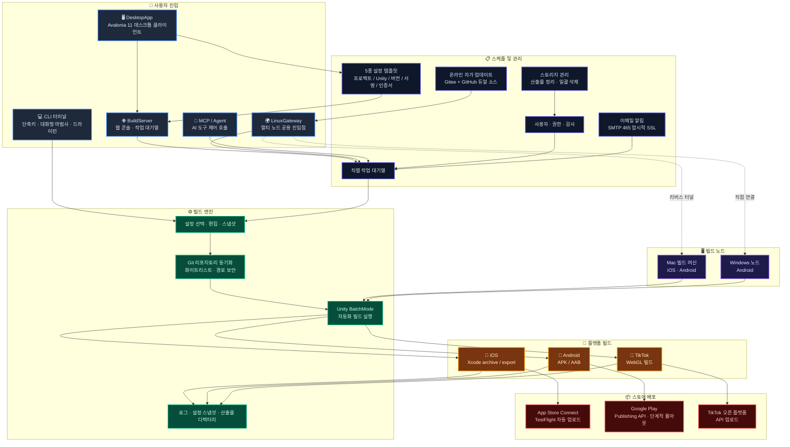

# AutomationUnityBuildIOS — Unity 멀티 플랫폼 자동 빌드 및 릴리스 시스템

> 프로덕션 환경에서 검증된 Unity 모바일 빌드 및 릴리스 툴체인. Git 동기화, Unity BatchMode, Xcode/Android 빌드부터 App Store Connect / TestFlight, Google Play, TikTok 미니게임 업로드까지 — 웹 빌드 플랫폼, 데스크톱 클라이언트, 다중 노드 게이트웨이 스케줄링, AI Agent 통합까지 전체 릴리스 파이프라인을 하나의 추적 가능하고 확장 가능한 엔드투엔드 워크플로로 통합합니다.

[](https://dotnet.microsoft.com/)
[](https://unity.com/)
[](docs/build-server.ko.md)
[](docs/usage.ko.md#데스크톱-클라이언트)
[](docs/linux-gateway.ko.md)
[](docs/usage.ko.md#회귀-테스트)
[](LICENSE)

[中文](README.md) | [English](README.en.md) | [日本語](README.ja.md) | [한국어](README.ko.md) | [Français](README.fr.md) | [Русский](README.ru.md) | [Español](README.es.md) | [Português](README.pt.md) | [전체 사용 가이드](docs/usage.ko.md) | [아키텍처](docs/architecture.ko.md)

---

## 저장소

- **Gitee**: https://gitee.com/chenfengloveyuri/automation-unity-build-ios
- **GitHub**: https://github.com/chenfengyimei/-AutomationUnityBuild

---

## 완전 자동화 파이프라인

완전한 게임 릴리스는 결코 "빌드하고 끝"나는 단발성 작업이 아니라, 촘촘히 연결된 파이프라인입니다. **AutomationUnityBuild는 이 파이프라인을 수작업 경험에서 재사용 가능하고, 추적 가능하며, 확장 가능한 시스템 능력으로 고정합니다**. 게임 개발부터 정식 출시까지 모든 단계를 다룹니다:

```
┌─────────────┐    ┌─────────────┐    ┌─────────────┐    ┌─────────────┐    ┌─────────────┐
│  게임 개발   │ →  │  자동 빌드   │ →  │  테스트 배포 │ →  │  스토어 등록 │ →  │  게임 출시   │
│  (Unity)    │    │  (CLI/Web)  │    │ (TestFlight)│    │ (App Store) │    │ (단계/정식) │
└─────────────┘    └─────────────┘    └─────────────┘    └─────────────┘    └─────────────┘
       ↑                                                                            │
       └──────────────────── 이메일 알림 / 로그 추적 / 설정 자산화 ←─────────────────────┘
```

| 단계 | 기존 방식 | AutomationUnityBuild 방식 |
|------|---------|---------------------------|
| **게임 개발** | 개발 후 Unity를 수동으로 열고 Build 클릭 후 30분 대기 | Git 저장소를 설정으로 관리, 클릭 한 번으로 최신 코드 가져오기, Unity BatchMode 무인 빌드 |
| **자동 빌드** | 명령어 암기, 경로 뒤지기, 인증서 찾기, 로그 수작업 확인 | CLI 숫자 단축 명령 / 웹 버튼 조작 / DesktopApp 클라이언트, 3가지 입구 선택 |
| **테스트 배포** | Transporter를 수동으로 열고 `.ipa` 드래그 후 업로드 대기, App Store Connect에서 제출 | 빌드 완료 후 App Store Connect API 자동 호출, TestFlight가 테스트 그룹에 자동 배포 |
| **스토어 등록** | 버전 번호 수동 입력, 빌드 선택, 심사 수동 제출 | 버전 번호 자동 증가, Google Play 단계적 출시 비율 설정 가능, TikTok 오픈 플랫폼 API 직접 업로드 |
| **게임 출시** | 채팅방에 "패키지 완료" 메시지, 테스터가 수동 다운로드 | 성공/실패 이메일 자동 알림, 산출물 중앙 저장, 빌드 이력 추적, 완전한 감사 로그 |

### 폐쇄 루프의 가치

- **하나의 설정, 어디서든**: 프로젝트/Unity/버전/서명/인증서 5종 템플릿을 축적하면 신규 멤버도 클릭 한 번으로 필드를 채워 빌드 시작. "특정 사람만 패키징 방법을 아는" 상황에서 탈피
- **한 번의 빌드, 여러 플랫폼**: 동일한 Unity 프로젝트에서 iOS `.ipa` + Android `.apk/.aab` + TikTok 미니게임 패키지 생성, 각자의 스토어로
- **한 번의 실패, 전체 추적**: 전체 로그, Unity 로그, Xcode 로그, Android 로그 계층 저장, 이메일 알림으로 즉시 문제 파악
- **하나의 입구, 다양한 형태**: CLI는 개발자용, 웹은 팀 협업용, DesktopApp은 오프라인 작업용, LinuxGateway는 멀티 머신 스케줄링용 — 동일한 핵심 로직, 4가지 사용 방식

이것이 AutomationUnityBuild가 존재하는 이유입니다: **게임 팀의 에너지를 게임 자체에 집중시키고, 반복적인 릴리스 작업에 소모하지 않게 합니다.**

---

## 개요

AutomationUnityBuildIOS는 Unity 모바일 프로젝트를 위한 엔드투엔드 자동 빌드 및 릴리스 시스템입니다.

단순한 스크립트 래퍼가 아닙니다. 소스 저장소부터 앱 스토어까지 전체 파이프라인을 커버하는 엔지니어링 플랫폼입니다. 최소 구성에서는 Mac에 복사하여 실행할 수 있는 .NET 8 명령줄 도구로 동작합니다. 설정을 선택하면 Unity 저장소를 자동으로 풀하고, Unity Editor 빌드 스크립트를 실행하고, iOS Xcode 프로젝트 또는 Android APK/AAB를 내보내고, 로그와 산출물을 생성합니다. 팀 모드에서는 웹 빌드 플랫폼으로 작동합니다. 프로젝트 리더가 웹 백엔드에서 프로젝트와 설정을 관리하고, 빌더가 클릭으로 작업을 제출하며, 모든人が 브라우저에서 대기열, 로그, 산출물, 감사 기록을 확인할 수 있습니다. 데스크톱 모드에서는 전체 오프라인 기능과 원클릭 템플릿 적용을 갖춘 네이티브 Windows 데스크톱 클라이언트를 제공합니다. 다중 장치 모드에서는 LinuxGateway를 사용하여 여러 Mac/Windows 빌드 머신을 하나의 공용 진입점으로 통합하며, 직접 연결과 리버스 터널을 모두 지원합니다.

또한 TikTok 미니게임 WebGL 빌드 및 오픈 플랫폼 API 업로드, 이메일 알림(성공/실패, SMTP 465 암시적 SSL), 스토리지 관리(산출물 정리 / 스토리지 개요 / 대량 삭제), 5종류 설정 템플릿(프로젝트 / Unity / 버전 / 서명 / 인증서), MCP 도구를 통한 AI Agent의 빌드 프로세스 참여 기능도 포함합니다.

이 시스템이 해결하는 것은 매우 구체적이지만 고통스러운 문제입니다. Unity 모바일 릴리스에서 매번 명령어를 외우고, 경로를 뒤지고, 인증서를 찾고, 로그를 수동으로 확인할 필요는 더 이상 없습니다.

---

## 대상 사용자

- **Unity 모바일 게임/앱 팀**: iOS `.ipa`, `.xcarchive`, Android `.apk` / `.aab`를 안정적으로 생성하고 App Store Connect / TestFlight / Google Play에 자동 업로드가 필요.
- **TikTok 미니게임 팀**: WebGL 빌드 후 TikTok 오픈 플랫폼에 직접 업로드가 필요.
- **인디 개발자**: Mac 빌드 단계를 재사용 가능한 설정으로 고정하고, 매번 릴리스 전의 수동 작업을 줄이고 싶음.
- **QA / 운영 / 퍼블리싱 팀**: 빌드 머신에 원격 로그인하는 대신 웹 UI 또는 데스크톱 클라이언트에서 빌드를 트리거하고 산출물을 다운로드하며 이력을 추적하고 싶음.
- **다중 플랫폼 빌드 팀**: Mac은 iOS와 Android를 담당하고 Windows 노드는 Android를 담당하며 LinuxGateway로 통합 스케줄링.
- **AI / Agent 워크플로 사용자**: Agent가 MCP 도구로 프로젝트 조회, 드라이런 제출, 상태 확인, 로그 및 산출물 읽기를 수행하기를 원함.

---

## 핵심 기능

| 기능 | 설명 | 문서 |
|------|------|------|
| **로컬 CLI 자동 빌드** | 숫자 단축 명령, 대화형 설정 마법사, 설정 선택기, 설정 편집기, 드라이런 및 환경 검사 | [사용 가이드](docs/usage.ko.md#로컬-cli-빠른-시작) |
| **iOS 전체 파이프라인** | Git 동기화, Unity Xcode 프로젝트 내보내기, `xcodebuild archive/export`, `.xcarchive`를 Organizer에 복사 | [iOS 빌드](docs/usage.ko.md#ios-빌드) |
| **App Store Connect 업로드** | API Key로 App Store Connect/TestFlight에 자동 업로드, 무인 파이프라인에 적합 | [스토어 업로드](docs/usage.ko.md#app-store-connect--testflight-업로드) |
| **Android APK/AAB** | `apk`, `aab`, `both` 3종 빌드 형식, Android keystore 및 버전 관리 호환 | [Android 빌드](docs/usage.ko.md#android-빌드) |
| **Google Play 퍼블리싱** | Service Account로 Google Play Publishing API 호출, track, release status, 단계적 롤아웃 지원 | [Google Play](docs/usage.ko.md#google-play-업로드) |
| **TikTok 미니게임** | WebGL 빌드 후 TikTok 오픈 플랫폼 API로 자동 업로드, 독립적인 `Modules/Tiktok/` 모듈 | [TikTok 빌드](docs/usage.ko.md#tiktok-미니게임-빌드) |
| **BuildServer 웹 플랫폼** | 로그인, 프로젝트/설정 관리, 작업 대기열, 실시간 로그, 산출물 다운로드, 사용자 권한, 감사 로그, 이메일 알림, 스토리지 관리 | [BuildServer](docs/build-server.ko.md) |
| **DesktopApp 데스크톱 클라이언트** | Avalonia UI 11 기반 네이티브 Windows 데스크톱 앱, 전체 기능 오프라인 설정 관리, 빌드 실행, 산출물 탐색, 템플릿 관리, 서버 동기화 | [데스크톱 클라이언트](docs/usage.ko.md#데스크톱-클라이언트) |
| **MCP / Agent 진입점** | `list_projects`, `start_build`, `get_build_status`, `tail_build_log` 등의 도구 제공 | [MCP/Agent](docs/build-server.ko.md#mcpagent) |
| **LinuxGateway 다중 노드 진입점** | Linux 공용 서버에서 여러 Mac/Windows BuildServer 노드를 통합, 직접 연결과 리버스 터널 지원 | [LinuxGateway](docs/linux-gateway.ko.md) |
| **이메일 알림** | 빌드 성공/실패 시 자동 이메일 발송, SMTP 465 암시적 SSL, 연락처 목록, 맞춤형 템플릿 지원 | [이메일 알림](docs/usage.ko.md#이메일-알림) |
| **스토리지 관리** | 산출물 수동 정리, 스토리지 개요, 대량 삭제, 빌드 머신 디스크 팽창 방지 | [스토리지 관리](docs/usage.ko.md#스토리지-관리) |
| **설정 템플릿** | 5종 템플릿(프로젝트 / Unity / 버전 / 서명 / 인증서), 원클릭 필드 채우기, 서버 양방향 동기화 지원 | [템플릿 관리](docs/usage.ko.md#템플릿-관리) |
| **보안 경계** | Git 저장소 화이트리스트, 경로 루트 제한, 설정 스냅샷, 민감 정보 마스킹, 로그인 및 감사 | [아키텍처](docs/architecture.ko.md#보안-기반) |
| **로그 및 산출물 추적** | 매 실행마다 독립 디렉터리 생성, 전체 로그, Unity 로그, Xcode/Android 로그, 설정 스냅샷 저장 | [로그 문제 해결](docs/usage.ko.md#로그와-산출물) |

---

## 빠른 시작

개발 머신에서 도움말과 드라이런을 먼저 실행하여 명령 진입점을 확인합니다:

```powershell
dotnet build .\AutomationUnityBuildIOS.sln
dotnet run --project .\AutomationUnityBuildIOS.csproj -- 00
dotnet run --project .\AutomationUnityBuildIOS.csproj -- run --config .\build-ios.sample.json --dry-run --allow-non-mac --skip-git --skip-xcode
dotnet run --project .\AutomationUnityBuildIOS.csproj -- run --config .\build-android.sample.json --dry-run --allow-non-mac --skip-git
```

실제 iOS 빌드는 macOS에서 실행해야 합니다. 일반적인 방법은 Windows/VS 또는 .NET 환경에서 Mac용 실행 파일을 먼저 게시하는 것입니다:

```powershell
.\scripts\publish-mac.ps1 -Runtime osx-arm64
```

`publish/osx-arm64`를 Mac에 복사 후:

```bash
cd ~/Downloads/publish_m1
xattr -cr .
chmod +x ./AutomationUnityBuildIOS
codesign --force --deep --sign - ./AutomationUnityBuildIOS
./AutomationUnityBuildIOS 00
./AutomationUnityBuildIOS 01
./AutomationUnityBuildIOS 06
```

전체 설정, 설정 필드, iOS/Android/TikTok 스토어 업로드, 웹 플랫폼, 데스크톱 클라이언트, 다중 노드 배포는 [docs/usage.ko.md](docs/usage.ko.md)를 참조하세요.

---

## 실행 모드

| 모드 | 사용 사례 | 진입점 |
|------|----------|-------|
| **CLI 독립 실행** | 개인 또는 소규모 팀, Mac 빌드 머신에서 직접 조작 | `./AutomationUnityBuildIOS 06` |
| **BuildServer 웹 모드** | 팀이 브라우저로 프로젝트, 설정, 대기열, 로그, 산출물 관리 | `http://127.0.0.1:5088` |
| **DesktopApp 데스크톱 모드** | 네이티브 Windows 데스크톱 클라이언트, 오프라인 설정 관리, 빌드 실행, 템플릿, 서버 동기화 | `DesktopApp.exe` |
| **MCP/Agent 모드** | AI Agent가 제어된 도구로 드라이런 제출, 상태 확인, 로그 읽기 | `POST /mcp` |
| **LinuxGateway 다중 노드 모드** | 여러 Mac/Windows 빌드 머신을 하나의 공용 진입점으로 통합, 직접 연결과 리버스 터널 지원 | `http://127.0.0.1:5090` |

---

## 아키텍처



BuildServer 초안은 싱글 머신, 싱글 Worker, 직렬 대기열 설계를 채택하고 있습니다. 이는 의도적인 설계입니다. Unity, Xcode, Gradle, 서명 인증서, 캐시 디렉터리는 일반적으로 같은 머신에서 동시에 경쟁하는 데 적합하지 않습니다. 다중 머신 확장은 LinuxGateway가 담당하며, 동시 스케줄링을 서로 다른 노드에 분산시킵니다. 직접 연결과 NAT 트래버설을 모두 지원합니다.

---

## 프로젝트 구조

```text
AutomationUnityBuildIOS/
├── Cli/                         # 명령 진입점, 인수 파싱, 숫자 단축키
├── ConsoleUi/                   # 대화형 메뉴, 설정 마법사, 설정 편집기
├── Configuration/               # 설정 모델, 템플릿, 경로 해석, 설정 파일 선택
├── Workflow/                    # 빌드 파이프라인 오케스트레이션, 실행 컨텍스트, 설정 스냅샷
├── Services/                    # Git, 환경 검사, 디렉터리 준비, 보안 경계 검증
├── Modules/
│   ├── Common/                  # 플랫폼 파이프라인, Unity 명령, 로그 진단
│   ├── Ios/                     # Unity iOS 내보내기, Xcode archive/export, ASC 업로드
│   ├── Android/                 # Android APK/AAB, Google Play Publishing API
│   └── Tiktok/                  # TikTok 미니게임 WebGL 빌드 및 오픈 플랫폼 업로드
├── Infrastructure/              # 로깅, 프로세스 실행, 경로 도구, 경로 보안, 민감 정보 마스킹
├── UnityBuildScripts/
│   ├── Ios/BuildIOS.cs          # Unity 프로젝트 Assets/Editor에 복사
│   └── Android/BuildAndroid.cs  # Unity 프로젝트 Assets/Editor에 복사
├── BuildServer/                 # 웹 빌드 플랫폼, 대기열 Worker, MCP, 노드 API, 이메일, 스토리지
├── LinuxGateway/                # 다중 장치 게이트웨이, 리버스 연결, 온라인 자가 업데이트
├── DesktopApp/                  # Avalonia UI 11 데스크톱 클라이언트, 템플릿, 서버 동기화
├── deploy/                      # launchd, Docker 배포 템플릿
├── docs/                        # 사용, 아키텍처, 배포 문서
├── scripts/                     # 게시 스크립트 (CLI/BuildServer/LinuxGateway/DesktopApp)
└── AutomationUnityBuildIOS.Tests/
```

---

## 문서 탐색

| 문서 | 내용 |
|------|------|
| [docs/usage.ko.md](docs/usage.ko.md) | CLI, DesktopApp, BuildServer, LinuxGateway, MCP 사용 가이드 |
| [docs/architecture.ko.md](docs/architecture.ko.md) | 디렉터리 책임, 핵심 모듈, 플랫폼 보안 기능 |
| [docs/build-server.ko.md](docs/build-server.ko.md) | BuildServer 시작, 데이터, MCP, Gateway API, 확장 방향 |
| [docs/linux-gateway.ko.md](docs/linux-gateway.ko.md) | LinuxGateway 노드 등록, 리버스 연결, 자가 업데이트, 배포 |
| [docs/linux-gateway-docker.md](docs/linux-gateway-docker.md) | LinuxGateway Docker 배포 가이드 |

---

## 개발 및 검증

```powershell
.\scripts\verify.ps1
```

이 스크립트는 솔루션 컴파일, CLI 도움말 진입점, iOS/Android 드라이런, 설정 편집기 열기-닫기, BuildServer/LinuxGateway 기본 컴파일 검증을 수행합니다.

테스트 스위트는 256개 이상의 테스트 케이스를 커버하며, CLI 인수 파싱, 설정 모델, 경로 보안, Git 정책, Unity 명령 빌드, Google Play API, TikTok 설정, BuildServer API 라우트, LinuxGateway 노드 통신, 리버스 연결, 이메일 알림 등 모든 모듈을 포괄합니다.

---

## 현재 상태

| 모듈 | 상태 |
|------|------|
| CLI iOS 자동 빌드 | ✅ 프로덕션 |
| CLI Android APK/AAB 빌드 | ✅ 프로덕션 |
| CLI TikTok 미니게임 빌드 | ✅ 사용 가능 |
| App Store Connect / TestFlight 업로드 | ✅ 프로덕션 |
| Google Play 업로드 | ✅ 프로덕션 |
| BuildServer 웹 플랫폼 | ✅ 사용 가능 |
| DesktopApp 데스크톱 클라이언트 | ✅ 사용 가능 |
| MCP/Agent 도구 진입점 | ✅ 사용 가능 |
| LinuxGateway 다중 노드 진입점 | ✅ 사용 가능 |
| LinuxGateway 리버스 연결 | ✅ 사용 가능 |
| LinuxGateway 온라인 자가 업데이트 | ✅ 사용 가능 |
| 이메일 알림 | ✅ 사용 가능 |
| 스토리지 관리 | ✅ 사용 가능 |
| 설정 템플릿 관리 | ✅ 사용 가능 |
| 다중 Worker DB 스케줄링 | 향후 진화 |

---

## 라이선스

이 프로젝트는 [Apache License 2.0](LICENSE) 하에 배포됩니다.
