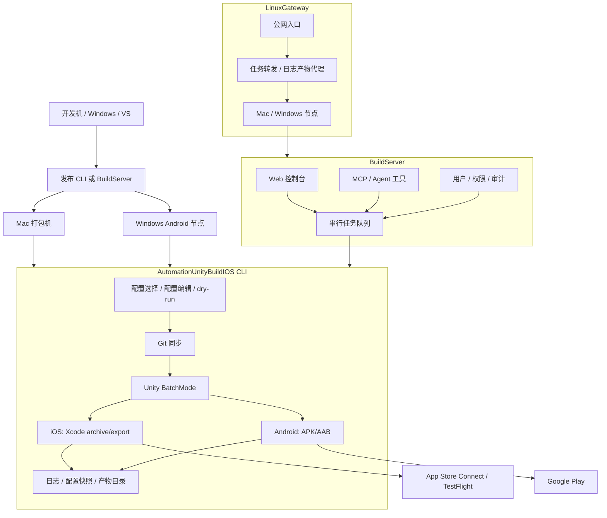

# AutomationUnityBuildIOS - Unity iOS / Android 自动化打包平台

> 面向 Unity 移动游戏的自动化构建与发布工具链。它把 Git 同步、Unity BatchMode、Xcode/Android 构建、App Store Connect/TestFlight、Google Play、Web 队列、日志产物、MCP/Agent 和多节点网关串成一条可落地的发布流水线。

[](https://dotnet.microsoft.com/)
[](https://unity.com/)
[](docs/build-server.md)
[](docs/linux-gateway.md)
[](LICENSE)

中文 | [完整使用文档](docs/usage.md) | [架构说明](docs/architecture.md)

---

## 项目仓库

- **Gitee**: https://gitee.com/chenfengloveyuri/automation-unity-build-ios

---

## 什么是 AutomationUnityBuildIOS？

AutomationUnityBuildIOS 是一套给 Unity 移动端项目准备的自动化打包平台。

最小形态下，它是一个可以拷到 Mac 上运行的 .NET 8 命令行工具：选择配置，然后自动拉取 Unity 仓库、执行 Unity Editor 构建脚本、导出 iOS Xcode 工程或 Android APK/AAB、生成日志与产物。团队形态下，它可以变成网页打包平台：负责人在 Web 后台维护项目和配置，构建员点击发起任务，所有人通过浏览器查看队列、日志、产物和审计记录。多设备形态下，它还能通过 LinuxGateway 把多台 Mac/Windows 打包机统一接入一个公网入口。

它解决的是一个很具体但很疼的问题：Unity 移动端发包不应该每次都靠人记命令、翻路径、找证书、手工看日志。

---

## 适合谁

- **Unity 手游/应用团队**：需要稳定生成 iOS `.ipa`、`.xcarchive`、Android `.apk` / `.aab`。
- **独立开发者**：想把 Mac 打包步骤固化成一套可复用配置，减少每次发包前的手工操作。
- **测试/运营/发行团队**：希望通过网页发起构建、下载产物、追踪历史，而不是远程登录打包机。
- **多平台构建团队**：Mac 负责 iOS 和 Android，Windows 节点负责 Android，通过 LinuxGateway 统一调度。
- **AI/Agent 工作流用户**：希望通过 MCP 工具让 Agent 查询项目、提交 dry-run、查看状态、读取日志和产物。

---

## 核心能力

| 能力 | 说明 | 文档 |
|------|------|------|
| **本地 CLI 自动打包** | 数字快捷指令、交互式配置向导、配置选择器、配置编辑器、dry-run 和环境检查 | [使用文档](docs/usage.md#本地-cli-快速开始) |
| **iOS 完整链路** | Git 同步、Unity 导出 Xcode 工程、`xcodebuild archive/export`、复制 `.xcarchive` 到 Organizer | [iOS 打包](docs/usage.md#ios-打包) |
| **App Store Connect 上传** | 通过 API Key 自动上传到 App Store Connect/TestFlight，适合无人值守流水线 | [商店上传](docs/usage.md#app-store-connect--testflight-上传) |
| **Android APK/AAB** | 支持 `apk`、`aab`、`both` 三种构建格式，兼容 Android keystore 和版本号管理 | [Android 打包](docs/usage.md#android-打包) |
| **Google Play 发布** | 使用 Service Account 调用 Google Play Publishing API，支持 track、release status 和灰度比例 | [Google Play](docs/usage.md#google-play-上传) |
| **BuildServer 网页平台** | 登录、项目/配置管理、任务队列、实时日志、产物下载、用户权限和审计日志 | [BuildServer](docs/build-server.md) |
| **MCP / Agent 入口** | 提供 `list_projects`、`start_build`、`get_build_status`、`tail_build_log` 等工具 | [MCP/Agent](docs/build-server.md#mcpagent) |
| **LinuxGateway 多节点入口** | 在 Linux 公网服务器上统一调度多台 Mac/Windows BuildServer 节点 | [LinuxGateway](docs/linux-gateway.md) |
| **安全边界** | Git 仓库白名单、路径根目录限制、配置快照、敏感信息脱敏、登录与审计 | [架构说明](docs/architecture.md#平台化前置能力) |
| **日志与产物追溯** | 每次运行生成独立目录，保存总日志、Unity 日志、Xcode/Android 日志和配置快照 | [日志排查](docs/usage.md#日志和产物) |

---

## 快速体验

在开发机上可以先跑帮助和 dry-run，确认命令入口正常：

```powershell
dotnet build .\AutomationUnityBuildIOS.sln
dotnet run --project .\AutomationUnityBuildIOS.csproj -- 00
dotnet run --project .\AutomationUnityBuildIOS.csproj -- run --config .\build-ios.sample.json --dry-run --allow-non-mac --skip-git --skip-xcode
dotnet run --project .\AutomationUnityBuildIOS.csproj -- run --config .\build-android.sample.json --dry-run --allow-non-mac --skip-git
```

真正的 iOS 构建必须在 macOS 上执行。常见发布方式是先在 Windows/VS 或任意 .NET 环境发布 Mac 可执行文件：

```powershell
.\scripts\publish-mac.ps1 -Runtime osx-arm64
```

把 `publish/osx-arm64` 拷到 Mac 后：

```bash
cd ~/Downloads/publish_m1
xattr -cr .
chmod +x ./AutomationUnityBuildIOS
codesign --force --deep --sign - ./AutomationUnityBuildIOS
./AutomationUnityBuildIOS 00
./AutomationUnityBuildIOS 01
./AutomationUnityBuildIOS 06
```

完整准备、配置字段、iOS/Android 商店上传、Web 平台和多节点部署请看 [docs/usage.md](docs/usage.md)。

---

## 运行方式

| 方式 | 适用场景 | 入口 |
|------|----------|------|
| **CLI 单机模式** | 单人或小团队，直接在 Mac 打包机上操作 | `./AutomationUnityBuildIOS 06` |
| **BuildServer 网页模式** | 团队通过浏览器管理项目、配置、队列、日志和产物 | `http://127.0.0.1:5088` |
| **MCP/Agent 模式** | 让 AI Agent 通过受控工具提交 dry-run、查询状态和读取日志 | `POST /mcp` |
| **LinuxGateway 多节点模式** | 多台 Mac/Windows 打包机接入一个公网调度入口 | `http://127.0.0.1:5090` |

---

## 整体架构



第一版 BuildServer 采用单机、单 Worker、串行队列设计，这是有意为之：Unity、Xcode、Gradle、签名证书和缓存目录通常不适合在同一台机器上并发抢占。多机器扩展由 LinuxGateway 负责，把并发调度分散到不同节点。

---

## 项目结构

```text
AutomationUnityBuildIOS/
├── Cli/                         # 命令入口、参数解析、数字快捷指令
├── ConsoleUi/                   # 交互式菜单、配置向导、配置编辑器
├── Configuration/               # 配置模型、模板、路径解析、配置文件选择
├── Workflow/                    # 自动化打包主流程、运行上下文、配置快照
├── Services/                    # Git、环境检查、目录准备、安全边界校验
├── Modules/
│   ├── Common/                  # 平台 Pipeline、Unity 命令、日志诊断
│   ├── Ios/                     # Unity 导出 iOS、Xcode archive/export、ASC 上传
│   └── Android/                 # Android APK/AAB、Google Play Publishing API
├── UnityBuildScripts/
│   ├── Ios/BuildIOS.cs          # 复制到 Unity 项目的 Assets/Editor
│   └── Android/BuildAndroid.cs  # 复制到 Unity 项目的 Assets/Editor
├── BuildServer/                 # Web 打包平台、队列 Worker、MCP、节点接口
├── LinuxGateway/                # 多设备统一入口和反向节点通道
├── deploy/                      # launchd、Docker 等部署模板
├── docs/                        # 使用、架构和部署文档
└── AutomationUnityBuildIOS.Tests/
```

---

## 文档导航

| 文档 | 内容 |
|------|------|
| [docs/usage.md](docs/usage.md) | 从零开始使用 CLI、BuildServer、LinuxGateway 和 MCP |
| [docs/architecture.md](docs/architecture.md) | 目录职责、核心模块、平台化安全能力 |
| [docs/build-server.md](docs/build-server.md) | BuildServer 的启动、数据、MCP、Gateway 接口和扩展方向 |
| [docs/linux-gateway.md](docs/linux-gateway.md) | LinuxGateway 的节点接入、任务转发和安全说明 |

---

## 开发与验证

```powershell
.\scripts\verify.ps1
```

这个脚本会执行解决方案编译、CLI 帮助入口、iOS/Android dry-run、配置编辑器打开退出，以及 BuildServer/LinuxGateway 基础编译验证。

---

## 当前状态

| 模块 | 状态 |
|------|------|
| CLI iOS 自动打包 | 已完成 |
| CLI Android APK/AAB 打包 | 已完成 |
| App Store Connect / Google Play 上传 | 已完成 |
| BuildServer Web 平台 | 已完成基础版 |
| MCP/Agent 工具入口 | 已完成基础版 |
| LinuxGateway 多节点入口 | 已完成基础版 |
| 多 Worker 数据库化调度 | 后续可演进 |

---

## 许可证

本项目基于 [Apache License 2.0](LICENSE) 开源。
