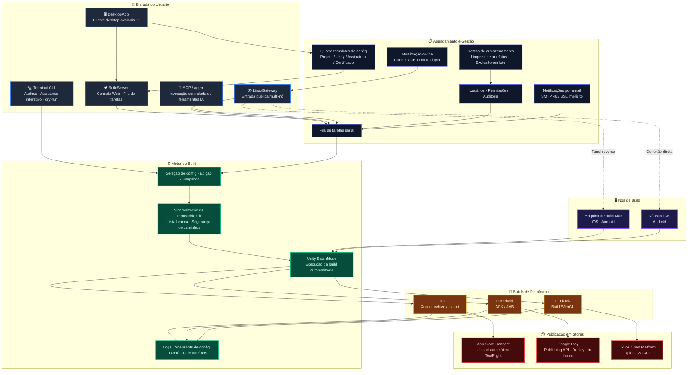

# AutomationUnityBuildIOS — Sistema de build e release automatizado multiplataforma para Unity

> Uma cadeia de ferramentas de build e release Unity móvel comprovada em produção. Da sincronização Git, Unity BatchMode, builds Xcode/Android até o upload para App Store Connect / TestFlight, Google Play e TikTok Mini-Game — estendida com uma plataforma web de build, um cliente desktop, um gateway multi-nó e integração de AI Agent. Transforma todo o pipeline de release em um fluxo de trabalho de ponta a ponta rastreável e escalável.

[](https://dotnet.microsoft.com/)
[](https://unity.com/)
[](docs/build-server.pt.md)
[](docs/usage.pt.md#cliente-desktop)
[](docs/linux-gateway.pt.md)
[](docs/usage.pt.md#testes-de-regressão)
[](LICENSE)

[中文](README.md) | [English](README.en.md) | [日本語](README.ja.md) | [한국어](README.ko.md) | [Français](README.fr.md) | [Русский](README.ru.md) | [Español](README.es.md) | [Português](README.pt.md) | [Guia completo](docs/usage.pt.md) | [Arquitetura](docs/architecture.pt.md)

---

## Repositórios

- **Gitee**: https://gitee.com/chenfengloveyuri/automation-unity-build-ios
- **GitHub**: https://github.com/chenfengyimei/-AutomationUnityBuild

---

## Descrição

AutomationUnityBuildIOS é um sistema de build e release automatizado de ponta a ponta, projetado para projetos Unity móveis.

Não é um simples wrapper de scripts — é uma plataforma de engenharia que cobre todo o pipeline, do repositório de código fonte até a loja de aplicativos. Em sua forma mínima, é uma ferramenta de linha de comando .NET 8 que roda em um Mac: selecione uma configuração e ele automaticamente faz pull do repositório Unity, executa os scripts de build do Unity Editor, exporta um projeto Xcode de iOS ou um APK/AAB de Android, e gera logs e artefatos. Em modo de equipe, torna-se uma plataforma web de build: líderes de equipe gerenciam projetos e configurações em um backend web, builders enviam tarefas com um clique, e todos visualizam a fila, logs, artefatos e registros de auditoria através de um navegador. Em modo desktop, fornece um cliente desktop Windows nativo com capacidades offline completas e aplicação de templates com um clique. Em modo multi-dispositivo, usa LinuxGateway para unificar múltiplas máquinas de build Mac/Windows sob um único ponto de entrada público, com suporte a conexão direta e túnel reverso.

Também cobre builds WebGL de TikTok Mini-Game com upload via API da Open Platform, notificações por email (sucesso/falha, SMTP 465 SSL implícito), gestão de armazenamento (limpeza de artefatos / visão geral / exclusão em massa), quatro tipos de templates de configuração (projeto / Unity / assinatura / certificado) e a participação de AI Agents no processo de build através de ferramentas MCP.

Resolve um problema muito específico, mas doloroso: releases Unity móveis nunca deveriam exigir memorizar comandos, procurar caminhos, caçar certificados ou ler logs manualmente toda vez.

---

## Público-alvo

- **Equipes de jogos/aplicativos Unity móveis**: precisam gerar de forma confiável `.ipa` de iOS, `.xcarchive`, `.apk` / `.aab` de Android, e fazer upload automaticamente para App Store Connect / TestFlight / Google Play.
- **Equipes de TikTok Mini-Game**: precisam de build WebGL e upload direto para a plataforma TikTok Open Platform.
- **Desenvolvedores independentes**: desejam fixar o processo de build do Mac em uma configuração reutilizável, reduzindo o trabalho manual antes de cada release.
- **Equipes de QA / ops / publishing**: desejam disparar builds, baixar artefatos e rastrear o histórico através de uma interface web ou cliente desktop em vez de fazer login remoto nas máquinas de build.
- **Equipes de build multiplataforma**: Mac lida com iOS e Android, nós Windows lidam com Android, tudo unificado sob LinuxGateway.
- **Usuários de workflows de AI / Agent**: desejam que os Agents consultem projetos, enviem dry-runs, verifiquem status e leiam logs e artefatos através de ferramentas MCP.

---

## Capacidades principais

| Capacidade | Descrição | Docs |
|------|------|------|
| **Build automatizado CLI local** | Comandos numéricos abreviados, assistente de configuração interativo, seletor de configuração, editor de configuração, dry-run e verificação de ambiente | [Guia](docs/usage.pt.md#início-rápido-cli-local) |
| **Pipeline iOS completo** | Sincronização Git, exportação de projeto Xcode do Unity, `xcodebuild archive/export`, cópia de `.xcarchive` para o Organizer | [Build iOS](docs/usage.pt.md#build-ios) |
| **Upload para App Store Connect** | Upload automático para App Store Connect/TestFlight via API Key, adequado para pipelines não supervisionados | [Upload para store](docs/usage.pt.md#upload-para-app-store-connect--testflight) |
| **Android APK/AAB** | Suporta formatos `apk`, `aab`, `both`, compatível com keystore Android e gerenciamento de versão | [Build Android](docs/usage.pt.md#build-android) |
| **Publicação no Google Play** | Usa Service Account para chamar a API Google Play Publishing, suporta track, release status e rollout progressivo | [Google Play](docs/usage.pt.md#upload-para-google-play) |
| **TikTok Mini-Game** | Build WebGL com upload automático via API da TikTok Open Platform, módulo independente `Modules/Tiktok/` | [Build TikTok](docs/usage.pt.md#build-tiktok-mini-game) |
| **Plataforma web BuildServer** | Login, gestão de projetos/configurações, fila de tarefas, logs em tempo real, download de artefatos, permissões de usuário, logs de auditoria, notificações por email, gestão de armazenamento | [BuildServer](docs/build-server.pt.md) |
| **Cliente desktop DesktopApp** | Aplicativo desktop Windows nativo em Avalonia UI 11, gestão de configuração offline completa, execução de builds, navegação de artefatos, gestão de templates, sincronização com servidor | [Cliente desktop](docs/usage.pt.md#cliente-desktop) |
| **Entrada MCP / Agent** | Fornece `list_projects`, `start_build`, `get_build_status`, `tail_build_log` e outras ferramentas | [MCP/Agent](docs/build-server.pt.md#mcpagent) |
| **Entrada multi-nó LinuxGateway** | Unifica múltiplos nós BuildServer Mac/Windows sob um único ponto de entrada público no Linux, suporta conexão direta e túnel reverso | [LinuxGateway](docs/linux-gateway.pt.md) |
| **Notificações por email** | Envio automático de emails de sucesso/falha, suporta SMTP 465 SSL implícito, listas de contatos, templates personalizados | [Notificações por email](docs/usage.pt.md#notificações-por-email) |
| **Gestão de armazenamento** | Limpeza manual de artefatos, visão geral de armazenamento, exclusão em massa, prevenção de inchaço de disco | [Gestão de armazenamento](docs/usage.pt.md#gestão-de-armazenamento) |
| **Templates de configuração** | Quatro tipos de templates (projeto / Unity / assinatura / certificado), preenchimento de campos com um clique, sincronização bidirecional com servidor | [Gestão de templates](docs/usage.pt.md#gestão-de-templates) |
| **Perímetros de segurança** | Lista branca de repositórios Git, restrição de caminhos raiz, snapshots de configuração, mascaramento de dados sensíveis, login e auditoria | [Arquitetura](docs/architecture.pt.md#fundamentos-de-segurança) |
| **Rastreabilidade de logs e artefatos** | Cada execução cria um diretório independente com logs completos, logs do Unity, logs de Xcode/Android e snapshot de configuração | [Solução de problemas](docs/usage.pt.md#logs-e-artefatos) |

---

## Início rápido

Na sua máquina de desenvolvimento, execute primeiro a ajuda e o dry-run para verificar o ponto de entrada:

```powershell
dotnet build .\AutomationUnityBuildIOS.sln
dotnet run --project .\AutomationUnityBuildIOS.csproj -- 00
dotnet run --project .\AutomationUnityBuildIOS.csproj -- run --config .\build-ios.sample.json --dry-run --allow-non-mac --skip-git --skip-xcode
dotnet run --project .\AutomationUnityBuildIOS.csproj -- run --config .\build-android.sample.json --dry-run --allow-non-mac --skip-git
```

Builds reais de iOS devem ser executados em macOS. A abordagem comum é publicar primeiro um executável Mac a partir do Windows/VS ou qualquer ambiente .NET:

```powershell
.\scripts\publish-mac.ps1 -Runtime osx-arm64
```

Copie `publish/osx-arm64` para o seu Mac, então:

```bash
cd ~/Downloads/publish_m1
xattr -cr .
chmod +x ./AutomationUnityBuildIOS
codesign --force --deep --sign - ./AutomationUnityBuildIOS
./AutomationUnityBuildIOS 00
./AutomationUnityBuildIOS 01
./AutomationUnityBuildIOS 06
```

Para configuração completa, campos de configuração, uploads iOS/Android/TikTok, plataforma web, cliente desktop e implantação multi-nó, veja [docs/usage.pt.md](docs/usage.pt.md).

---

## Modos de execução

| Modo | Caso de uso | Ponto de entrada |
|------|----------|-------|
| **CLI autônomo** | Individual ou equipe pequena, operação direta na máquina de build Mac | `./AutomationUnityBuildIOS 06` |
| **BuildServer modo web** | A equipe gerencia projetos, configurações, filas, logs e artefatos via navegador | `http://127.0.0.1:5088` |
| **DesktopApp modo desktop** | Cliente desktop Windows nativo, gestão de configuração offline, execução de builds, templates, sincronização com servidor | `DesktopApp.exe` |
| **Modo MCP/Agent** | AI Agents enviam dry-runs, consultam status e leem logs através de ferramentas controladas | `POST /mcp` |
| **LinuxGateway multi-nó** | Múltiplas máquinas de build Mac/Windows unificadas sob um único ponto de entrada público, suporta conexão direta e túnel reverso | `http://127.0.0.1:5090` |

---

## Arquitetura



A primeira versão do BuildServer usa um design de máquina única, worker único, fila serial — por design: Unity, Xcode, Gradle, certificados de assinatura e diretórios de cache geralmente não toleram contenção concorrente na mesma máquina. A escalabilidade multi-máquina é gerenciada pelo LinuxGateway, distribuindo o agendamento concorrente entre diferentes nós, com suporte a conexão direta e traversal NAT.

---

## Estrutura do projeto

```text
AutomationUnityBuildIOS/
├── Cli/                         # Ponto de entrada de comandos, parsing de argumentos, atalhos numéricos
├── ConsoleUi/                   # Menu interativo, assistente de configuração, editor de configuração
├── Configuration/               # Modelos de configuração, templates, resolução de caminhos, seleção de arquivos de config
├── Workflow/                    # Orquestração do pipeline de build, contexto de execução, snapshots de configuração
├── Services/                    # Git, verificações de ambiente, preparação de diretórios, validação de segurança
├── Modules/
│   ├── Common/                  # Pipeline de plataforma, comandos Unity, diagnóstico de logs
│   ├── Ios/                     # Exportação Unity iOS, Xcode archive/export, upload ASC
│   ├── Android/                 # Android APK/AAB, API Google Play Publishing
│   └── Tiktok/                  # Build WebGL TikTok Mini-Game e upload para Open Platform
├── Infrastructure/              # Logging, execução de processos, ferramentas de caminho, segurança de caminhos, mascaramento de dados
├── UnityBuildScripts/
│   ├── Ios/BuildIOS.cs          # Copiar para Assets/Editor do projeto Unity
│   └── Android/BuildAndroid.cs  # Copiar para Assets/Editor do projeto Unity
├── BuildServer/                 # Plataforma web de build, worker de fila, MCP, API de nó, email, armazenamento
├── LinuxGateway/                # Gateway multi-dispositivo, conexão reversa, atualização online
├── DesktopApp/                  # Cliente desktop Avalonia UI 11, templates, sincronização com servidor
├── deploy/                      # Templates de implantação launchd, Docker
├── docs/                        # Documentação de uso, arquitetura e implantação
├── scripts/                     # Scripts de publicação (CLI/BuildServer/LinuxGateway/DesktopApp)
└── AutomationUnityBuildIOS.Tests/
```

---

## Navegação da documentação

| Documento | Conteúdo |
|------|------|
| [docs/usage.pt.md](docs/usage.pt.md) | Guia de início com CLI, DesktopApp, BuildServer, LinuxGateway e MCP |
| [docs/architecture.pt.md](docs/architecture.pt.md) | Responsabilidades de diretórios, módulos principais, capacidades de segurança da plataforma |
| [docs/build-server.pt.md](docs/build-server.pt.md) | Início do BuildServer, dados, MCP, API Gateway e direções de extensão |
| [docs/linux-gateway.pt.md](docs/linux-gateway.pt.md) | Registro de nós LinuxGateway, conexão reversa, atualização, implantação |
| [docs/linux-gateway-docker.md](docs/linux-gateway-docker.md) | Guia de implantação Docker para LinuxGateway |

---

## Desenvolvimento e verificação

```powershell
.\scripts\verify.ps1
```

Este script realiza a compilação da solução, entrada de ajuda CLI, dry-run iOS/Android, abertura-fechamento do editor de configuração e verificação de compilação básica do BuildServer/LinuxGateway.

A suíte de testes cobre 256+ casos de teste, abrangendo parsing de argumentos CLI, modelos de configuração, segurança de caminhos, políticas Git, construção de comandos Unity, API Google Play, configurações TikTok, rotas de API BuildServer, comunicação de nós LinuxGateway, conexão reversa, notificações por email e todos os outros módulos.

---

## Status atual

| Módulo | Status |
|------|------|
| Build automatizado iOS CLI | ✅ Produção |
| Build Android APK/AAB CLI | ✅ Produção |
| Build TikTok Mini-Game CLI | ✅ Utilizável |
| Upload para App Store Connect / TestFlight | ✅ Produção |
| Upload para Google Play | ✅ Produção |
| Plataforma web BuildServer | ✅ Utilizável |
| Cliente desktop DesktopApp | ✅ Utilizável |
| Entrada de ferramentas MCP/Agent | ✅ Utilizável |
| Entrada multi-nó LinuxGateway | ✅ Utilizável |
| Conexão reversa LinuxGateway | ✅ Utilizável |
| Atualização online LinuxGateway | ✅ Utilizável |
| Notificações por email | ✅ Utilizável |
| Gestão de armazenamento | ✅ Utilizável |
| Gestão de templates de configuração | ✅ Utilizável |
| Agendamento multi-worker com banco de dados | Evolução futura |

---

## Licença

Este projeto é licenciado sob a [Apache License 2.0](LICENSE).
