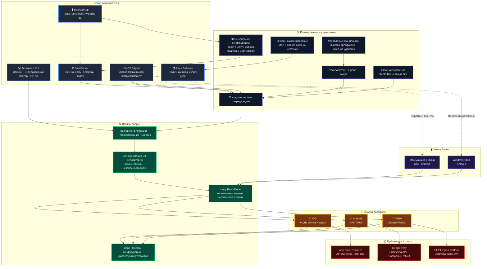

# AutomationUnityBuildIOS — Мультиплатформенная система автоматической сборки и релиза Unity

> Проверенный в продакшене инструментальный конвейер для сборки и релиза Unity-мобильных приложений. От синхронизации Git, Unity BatchMode, сборки Xcode/Android до загрузки в App Store Connect / TestFlight, Google Play и TikTok Mini-Game — расширенный веб-платформой сборки, десктопным клиентом, многоузловым шлюзом и интеграцией AI Agent. Превращает весь релизный конвейер в единый, отслеживаемый и масштабируемый сквозной рабочий процесс.

[](https://dotnet.microsoft.com/)
[](https://unity.com/)
[](docs/build-server.ru.md)
[](docs/usage.ru.md#десктопный-клиент)
[](docs/linux-gateway.ru.md)
[](docs/usage.ru.md#регрессионное-тестирование)
[](LICENSE)

[中文](README.md) | [English](README.en.md) | [日本語](README.ja.md) | [한국어](README.ko.md) | [Français](README.fr.md) | [Русский](README.ru.md) | [Español](README.es.md) | [Português](README.pt.md) | [Полное руководство](docs/usage.ru.md) | [Архитектура](docs/architecture.ru.md)

---

## Репозитории

- **Gitee**: https://gitee.com/chenfengloveyuri/automation-unity-build-ios
- **GitHub**: https://github.com/chenfengyimei/-AutomationUnityBuild

---

## Полностью автоматизированный конвейер

Полноценный релиз игры никогда не был изолированным действием «просто собрать» — это взаимосвязанный конвейер, где каждое звено влияет на следующее. **AutomationUnityBuild превращает этот конвейер из ручного опыта в переиспользуемую, отслеживаемую и расширяемую системную возможность**, покрывая каждый этап от разработки игры до официального релиза:

```
┌──────────────┐    ┌──────────────┐    ┌──────────────┐    ┌──────────────┐    ┌──────────────┐
│  Разработка  │    │Автосборка    │    │ Загрузка на  │    │ Загрузка в   │    │   Релиз      │
│    (Unity)   │ ─▶ │  (CLI/Web)   │ ─▶ │ (TestFlight) │ ─▶ │ (App Store)  │ ─▶ │(этапный/GA)  │
└──────────────┘    └──────────────┘    └──────────────┘    └──────────────┘    └──────────────┘
       ▲                                                                              │
       └──────────── Почта / Логи / Конфигурации ◀────────────────────────────────────┘
```

| Этап | Традиционный подход | Подход AutomationUnityBuild |
|------|---------|---------------------------|
| **Разработка игры** | Вручную открыть Unity после разработки, нажать Build, ждать полчаса | Git-репозитории в конфигах, получение свежего кода в один клик, сборки Unity BatchMode без участия человека |
| **Автосборка** | Запоминать команды, искать пути и сертификаты, читать логи вручную | Цифровые команды CLI / кнопки в Web / клиент DesktopApp — три точки входа на выбор |
| **Загрузка на тест** | Вручную открыть Transporter, перетащить `.ipa`, ждать, затем отправить в App Store Connect | После сборки автоматически вызывается API App Store Connect, TestFlight сам распределяет билд тестовым группам |
| **Загрузка в магазин** | Вручную вписать номера версий, выбрать билд, подать на проверку | Автоинкремент версии, настраиваемый поэтапный rollout в Google Play, прямая загрузка через API TikTok Open Platform |
| **Релиз игры** | Сообщение «пакет готов» в чате, тестеры качают вручную | Email-уведомления об успехе/провале, централизованное хранение артефактов, прослеживаемая история сборок, полные аудит-логи |

### Ценность замкнутого цикла

- **Одна конфигурация — везде**: после того как пять типов шаблонов (проект / Unity / версия / подпись / сертификат) зафиксированы, новый участник заполняет поля одним кликом и запускает сборку — больше не «только он умеет паковать»
- **Одна сборка — много площадок**: один проект Unity даёт iOS `.ipa` + Android `.apk/.aab` + пакет TikTok Mini-Game, каждый идёт в свой стор
- **Один сбой — полная прослеживаемость**: общий лог, логи Unity, Xcode и Android хранятся послойно, email-уведомления сразу указывают на проблему
- **Один вход — разные формы**: CLI для разработчиков, Web для командной работы, DesktopApp для офлайна, LinuxGateway для диспетчеризации машин — одна и та же логика, четыре способа работы

В этом и есть смысл существования AutomationUnityBuild: **вернуть энергию игровой команде для самой игры, а не для рутины повторяющихся релизов.**

---

## Описание

AutomationUnityBuildIOS — это сквозная система автоматизированной сборки и релиза, созданная для Unity-мобильных проектов.

Это не просто обёртка над скриптами — это инженерная платформа, покрывающая весь конвейер от репозитория исходного кода до магазина приложений. В минимальной конфигурации это инструмент командной строки .NET 8, работающий на Mac: выберите конфигурацию, и он автоматически pulls Unity-репозиторий, выполняет скрипты сборки Unity Editor, экспортирует iOS Xcode-проект или Android APK/AAB и генерирует логи и артефакты. В командном режиме он становится веб-платформой сборки: руководители управляют проектами и конфигурациями в веб-бэкенде, сборщики отправляют задачи одним кликом, а все просматривают очередь, логи, артефакты и аудиторские записи через браузер. В десктопном режиме он предоставляет нативный Windows-клиент с полной офлайн-функциональностью и применением шаблонов в один клик. В многоустройском режиме он использует LinuxGateway для объединения нескольких Mac/Windows машин сборки под единую публичную точку входа с поддержкой прямых и обратных подключений.

Он также охватывает WebGL-сборки TikTok Mini-Game с загрузкой через Open Platform API, email-уведомления (успех/провал, SMTP 465 неявный SSL), управление хранилищем (очистка артефактов / обзор хранилища / массовое удаление), пять типов шаблонов конфигурации (проект / Unity / версия / подпись / сертификат) и участие AI Agent в процессе сборки через инструменты MCP.

Он решает очень конкретную, но болезненную проблему: релизы Unity-мобильных приложений больше не должны требовать запоминания команд, поиска путей, hunt за сертификатами или ручного чтения логов каждый раз.

---

## Целевая аудитория

- **Команды Unity мобильных игр/приложений**: требуется надёжно генерировать iOS `.ipa`, `.xcarchive`, Android `.apk` / `.aab` и автоматически загружать в App Store Connect / TestFlight / Google Play.
- **Команды TikTok Mini-Game**: требуется WebGL-сборка с прямой загрузкой на платформу TikTok Open Platform.
- **Инди-разработчики**: хотят зафиксировать процесс сборки Mac в виде повторно используемой конфигурации, сокращая ручную работу перед каждым релизом.
- **QA / ops / publishing-команды**: хотят запускать сборки, скачивать артефакты и отслеживать историю через веб-интерфейс или десктопный клиент вместо удалённого входа на машины сборки.
- **Мультиплатформенные команды сборки**: Mac обрабатывает iOS и Android, Windows-узлы обрабатывают Android, всё объединено под LinuxGateway.
- **Пользователи AI / Agent workflow**: хотят, чтобы Agent запрашивал проекты, отправлял dry-run, проверял статусы и читал логи и артефакты через инструменты MCP.

---

## Ключевые возможности

| Возможность | Описание | Документация |
|------|------|------|
| **Локальная CLI-автосборка** | Цифровые быстрые команды, интерактивный мастер конфигурации, выбор конфигурации, редактор конфигурации, dry-run и проверка окружения | [Руководство](docs/usage.ru.md#быстрый-старт-локального-cli) |
| **Полный конвейер iOS** | Синхронизация Git, экспорт Unity Xcode-проекта, `xcodebuild archive/export`, копирование `.xcarchive` в Organizer | [Сборка iOS](docs/usage.ru.md#сборка-ios) |
| **Загрузка в App Store Connect** | Автоматическая загрузка в App Store Connect/TestFlight через API Key, подходит для автоматизированных конвейеров | [Загрузка в store](docs/usage.ru.md#загрузка-в-app-store-connect--testflight) |
| **Android APK/AAB** | Поддержка форматов `apk`, `aab`, `both`, совместимость с Android keystore и управлением версиями | [Сборка Android](docs/usage.ru.md#сборка-android) |
| **Публикация в Google Play** | Использование Service Account для вызова Google Play Publishing API, поддержка track, release status и поэтапного развёртывания | [Google Play](docs/usage.ru.md#загрузка-в-google-play) |
| **TikTok Mini-Game** | WebGL-сборка с автоматической загрузкой через TikTok Open Platform API, независимый модуль `Modules/Tiktok/` | [Сборка TikTok](docs/usage.ru.md#сборка-tiktok-mini-game) |
| **Веб-платформа BuildServer** | Вход, управление проектами/конфигурациями, очередь задач, логи в реальном времени, скачивание артефактов, права пользователей, аудит, email-уведомления, управление хранилищем | [BuildServer](docs/build-server.ru.md) |
| **Десктопный клиент DesktopApp** | Нативное Windows-приложение на Avalonia UI 11, полное офлайн-управление конфигурациями, выполнение сборок, просмотр артефактов, управление шаблонами, синхронизация с сервером | [Десктопный клиент](docs/usage.ru.md#десктопный-клиент) |
| **Вход MCP / Agent** | Предоставляет `list_projects`, `start_build`, `get_build_status`, `tail_build_log` и другие инструменты | [MCP/Agent](docs/build-server.ru.md#mcpagent) |
| **Многоузловой вход LinuxGateway** | Объединение нескольких узлов BuildServer Mac/Windows под единой публичной точкой входа на Linux, поддержка прямого и обратного подключения | [LinuxGateway](docs/linux-gateway.ru.md) |
| **Email-уведомления** | Автоматическая отправка email при успехе/провале сборки, поддержка SMTP 465 неявного SSL, списков контактов, персонализированных шаблонов | [Email-уведомления](docs/usage.ru.md#email-уведомления) |
| **Управление хранилищем** | Ручная очистка артефактов, обзор хранилища, массовое удаление, предотвращение переполнения диска | [Управление хранилищем](docs/usage.ru.md#управление-хранилищем) |
| **Шаблоны конфигурации** | Пять типов шаблонов (проект / Unity / версия / подпись / сертификат), заполнение полей в один клик, двусторонняя синхронизация с сервером | [Управление шаблонами](docs/usage.ru.md#управление-шаблонами) |
| **Периметры безопасности** | Белый список Git-репозиториев, ограничение корневых путей, снимки конфигурации, маскирование чувствительных данных, вход и аудит | [Архитектура](docs/architecture.ru.md#фундамент-безопасности) |
| **Отслеживание логов и артефактов** | Каждый запуск создаёт независимый каталог с полными логами, логами Unity, логами Xcode/Android и снимком конфигурации | [Устранение неполадок](docs/usage.ru.md#логи-и-артефакты) |

---

## Быстрый старт

На машине разработчика сначала запустите help и dry-run для проверки точки входа:

```powershell
dotnet build .\AutomationUnityBuildIOS.sln
dotnet run --project .\AutomationUnityBuildIOS.csproj -- 00
dotnet run --project .\AutomationUnityBuildIOS.csproj -- run --config .\build-ios.sample.json --dry-run --allow-non-mac --skip-git --skip-xcode
dotnet run --project .\AutomationUnityBuildIOS.csproj -- run --config .\build-android.sample.json --dry-run --allow-non-mac --skip-git
```

Реальные сборки iOS должны выполняться на macOS. Обычный подход — сначала опубликовать Mac-исполняемый файл из Windows/VS или любой .NET-среды:

```powershell
.\scripts\publish-mac.ps1 -Runtime osx-arm64
```

Скопируйте `publish/osx-arm64` на Mac, затем:

```bash
cd ~/Downloads/publish_m1
xattr -cr .
chmod +x ./AutomationUnityBuildIOS
codesign --force --deep --sign - ./AutomationUnityBuildIOS
./AutomationUnityBuildIOS 00
./AutomationUnityBuildIOS 01
./AutomationUnityBuildIOS 06
```

Полная настройка, поля конфигурации, загрузки iOS/Android/TikTok, веб-платформа, десктопный клиент и многоузловое развёртывание — см. [docs/usage.ru.md](docs/usage.ru.md).

---

## Режимы работы

| Режим | Сценарий использования | Точка входа |
|------|----------|-------|
| **CLI автономный** | Соло или небольшая команда, прямая работа на Mac-машине сборки | `./AutomationUnityBuildIOS 06` |
| **BuildServer веб-режим** | Команда управляет проектами, конфигурациями, очередями, логами и артефактами через браузер | `http://127.0.0.1:5088` |
| **DesktopApp десктоп-режим** | Нативный Windows-клиент, офлайн-управление конфигурациями, выполнение сборок, шаблоны, синхронизация с сервером | `DesktopApp.exe` |
| **Режим MCP/Agent** | AI Agent отправляет dry-run, запрашивает статусы и читает логи через контролируемые инструменты | `POST /mcp` |
| **LinuxGateway многоузловой режим** | Несколько Mac/Windows машин сборки объединены под единой публичной точкой входа, поддержка прямого и обратного подключения | `http://127.0.0.1:5090` |

---

## Архитектура



Первая версия BuildServer использует дизайн с одной машиной, одним Worker и последовательной очередью — по замыслу: Unity, Xcode, Gradle, сертификаты подписи и каталоги кэша обычно не переносят конкурентного взаимодействия на одной машине. Машинное масштабирование обрабатывается LinuxGateway, распределяя параллельное планирование по разным узлам с поддержкой прямых подключений и NAT-траверса.

---

## Структура проекта

```text
AutomationUnityBuildIOS/
├── Cli/                         # Точка входа, парсинг аргументов, цифровые ярлыки
├── ConsoleUi/                   # Интерактивное меню, мастер конфигурации, редактор конфигурации
├── Configuration/               # Модели конфигурации, шаблоны, разрешение путей, выбор файлов конфигурации
├── Workflow/                    # Оркестрация конвейера сборки, контекст выполнения, снимки конфигурации
├── Services/                    # Git, проверка окружения, подготовка каталогов, валидация безопасности
├── Modules/
│   ├── Common/                  # Платформенный конвейер, команды Unity, диагностика логов
│   ├── Ios/                     # Экспорт Unity iOS, Xcode archive/export, загрузка ASC
│   ├── Android/                 # Android APK/AAB, Google Play Publishing API
│   └── Tiktok/                  # WebGL-сборка TikTok Mini-Game и загрузка в Open Platform
├── Infrastructure/              # Логирование, выполнение процессов, инструменты путей, безопасность путей, маскирование данных
├── UnityBuildScripts/
│   ├── Ios/BuildIOS.cs          # Копировать в Assets/Editor Unity-проекта
│   └── Android/BuildAndroid.cs  # Копировать в Assets/Editor Unity-проекта
├── BuildServer/                 # Веб-платформа сборки, Worker очереди, MCP, API узла, email, хранилище
├── LinuxGateway/                # Многоустройский шлюз, обратное подключение, онлайн-самообновление
├── DesktopApp/                  # Десктопный клиент Avalonia UI 11, шаблоны, синхронизация с сервером
├── deploy/                      # Шаблоны развёртывания launchd, Docker
├── docs/                        # Документация по использованию, архитектуре и развёртыванию
├── scripts/                     # Скрипты публикации (CLI/BuildServer/LinuxGateway/DesktopApp)
└── AutomationUnityBuildIOS.Tests/
```

---

## Навигация по документации

| Документ | Содержание |
|------|------|
| [docs/usage.ru.md](docs/usage.ru.md) | Руководство по CLI, DesktopApp, BuildServer, LinuxGateway и MCP |
| [docs/architecture.ru.md](docs/architecture.ru.md) | Ответственность каталогов, ключевые модули, возможности безопасности платформы |
| [docs/build-server.ru.md](docs/build-server.ru.md) | Запуск BuildServer, данные, MCP, API Gateway и направления расширения |
| [docs/linux-gateway.ru.md](docs/linux-gateway.ru.md) | Регистрация узлов LinuxGateway, обратное подключение, самообновление, развёртывание |
| [docs/linux-gateway-docker.md](docs/linux-gateway-docker.md) | Руководство по Docker-развёртыванию LinuxGateway |

---

## Разработка и проверка

```powershell
.\scripts\verify.ps1
```

Этот скрипт выполняет компиляцию решения, точку входа help CLI, dry-run iOS/Android, открытие-закрытие редактора конфигурации и базовую проверку компиляции BuildServer/LinuxGateway.

Набор тестов покрывает 256+ тестовых случаев, охватывая парсинг аргументов CLI, модели конфигурации, безопасность путей, политики Git, построение команд Unity, Google Play API, конфигурации TikTok, маршруты API BuildServer, взаимодействие узлов LinuxGateway, обратное подключение, email-уведомления и все остальные модули.

---

## Текущий статус

| Модуль | Статус |
|------|------|
| CLI автоматическая сборка iOS | ✅ Продакшен |
| CLI сборка Android APK/AAB | ✅ Продакшен |
| CLI сборка TikTok Mini-Game | ✅ Готов к использованию |
| Загрузка в App Store Connect / TestFlight | ✅ Продакшен |
| Загрузка в Google Play | ✅ Продакшен |
| Веб-платформа BuildServer | ✅ Готов к использованию |
| Десктопный клиент DesktopApp | ✅ Готов к использованию |
| Вход инструментов MCP/Agent | ✅ Готов к использованию |
| Многоузловой вход LinuxGateway | ✅ Готов к использованию |
| Обратное подключение LinuxGateway | ✅ Готов к использованию |
| Онлайн-самообновление LinuxGateway | ✅ Готов к использованию |
| Email-уведомления | ✅ Готов к использованию |
| Управление хранилищем | ✅ Готов к использованию |
| Управление шаблонами конфигурации | ✅ Готов к использованию |
| Многопоточное планирование с БД | Будущее развитие |

---

## Лицензия

Этот проект лицензирован под [Apache License 2.0](LICENSE).
